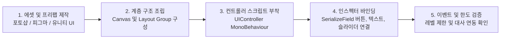

# FX Overdose - 종합 UI 제작 및 조립 가이드 (UI Assembly & Design Guide)

본 문서는 **FX Overdose** 프로젝트의 UI 제작자(아티스트/디자이너) 및 유니티 조립 작업자를 위한 **종합 UI/UX 가이드**입니다.  
각 기능별 화면 뼈대(Hierarchy), 에셋 제작 요구사항, 그리고 C# 컨트롤러와 인스펙터 상에서 연결해야 할 **필드/메서드/이벤트 명세표**를 제공합니다.

---

## 🏗️ UI 제작 및 조립 워크플로우 요약



1. **에셋 분리 및 9-Slice 적용**: 각 패널 배경, 버튼, 게이지 바 등은 해상도 대응을 위해 9-Slice Sprite로 제작합니다.
2. **컨트롤러 중심 모듈화**: 각 메인 UI 영역(하단 매매 패널, 상단 상태바, 레벨업 창, 설정 창)마다 전용 UI Controller 스크립트가 존재하며, 인스펙터에서 마우스 드래그 앤 드롭으로 UI 요소들을 바인딩합니다.
3. **이벤트 기반 동기화**: C# 코어 시스템(`TraderLevelSystem`, `TradingController`, `GameManager`)에서 값이 변할 때마다 이벤트를 발행(`Invoke`)하므로, UI는 프레임 낭비 없이 변경된 시점에 즉시 갱신됩니다.

---

## 📊 [파트 1] 하단 매매 컨트롤 및 포지션 오버레이 UI (`TradingPanelUIController.cs`)

### 1. 권장 Hierarchy 뼈대 구조
```text
Canvas_MainUI
 └── TradingPanel (Bottom Area)
      ├── TopModeTabs (탭 전환 바)
      │    ├── BtnTab_LeverageMode (레버리지 탭)
      │    └── BtnTab_MarginRatioMode (투자비율 탭)
      ├── ControlContainers
      │    ├── LeverageContainer (레버리지 조절 영역)
      │    │    ├── LeverageValueText ("10x")
      │    │    ├── Btn_LevMinus / Btn_LevPlus (- / + 버튼)
      │    │    └── PresetsGrid (1x, 5x, 10x, 25x, 50x, 100x, 125x 버튼)
      │    └── MarginRatioContainer (투자 사용 비율 조절 영역)
      │         ├── MarginValueText ("30% ($750)")
      │         ├── MarginSlider (0.10 ~ 1.0 슬라이더)
      │         ├── Btn_MarginMinus / Btn_MarginPlus (-10% / +10% 버튼)
      │         └── PresetsGrid (10%, 25%, 50%, 75%, 100% 버튼)
      ├── ActionButtonsArea (하단 3대 매매 액션 버튼)
      │    ├── LongButton (매수 LONG - 하위 SubtitleText 포함)
      │    ├── ShortButton (매도 SHORT - 하위 SubtitleText 포함)
      │    └── ClosePositionButton (포지션 청산/종료 버튼 - 보유 중일 때만 표시)
      └── PositionStatusOverlay (포지션 보유 시 실시간 상태 덮어쓰기 패널)
           ├── PositionTypeText ("[플레이어] Long 25x" 또는 "[AI] Short 50x")
           ├── ROEText ("+45.20%" - 양수 초록색 / 음수 빨간색)
           ├── PnLText ("PnL: +$340.50")
           ├── EntryPriceText ("ENTRY: $65,240.0")
           ├── LiquidationPriceText ("LIQ: $62,100.0 | STOP: $64,000.0")
           └── TargetPriceText ("TARGET: $68,500.0 (AI 목표가)" 또는 "TARGET: 직접 판단 익절 (수동)")
```

---

### 2. 인스펙터 바인딩 명세 (`[SerializeField]`)
스크립트 파일: `Assets/Scripts/UI/Chart/TradingPanelUIController.cs`

| 인스펙터 필드명 | UI 타입 | 바인딩 대상 및 설명 |
| :--- | :--- | :--- |
| `longButton` | `Button` | 매수(LONG) 액션 버튼 (클릭 시 `OpenPlayerPosition` 호출) |
| `shortButton` | `Button` | 매도(SHORT) 액션 버튼 (클릭 시 `OpenPlayerPosition` 호출) |
| `closePositionButton` | `Button` | 포지션 청산 버튼 (포지션 보유 중에만 `SetActive(true)` 및 클릭 시 `ClosePosition` 호출) |
| `longSubtitleText` / `shortSubtitleText` | `TMP_Text` | 버튼 하단 상태 안내 텍스트 (예: "LONG 수동 매수" vs "AI 자동 매수 대기") |
| `btnTabLeverageMode` / `btnTabMarginRatioMode` | `Button` | 조작 탭 전환 버튼 (클릭 시 `SwitchControlMode` 호출) |
| `leverageControlContainer` | `GameObject` | 레버리지 조작 UI 패널 묶음 (탭 전환 시 표시/숨김) |
| `marginRatioControlContainer` | `GameObject` | 투자 비율 조작 UI 패널 묶음 (탭 전환 시 표시/숨김) |
| `leverageDisplayText` / `marginRatioDisplayText` | `TMP_Text` | 현재 선택된 레버리지 배율 및 투자 사용 금액 표시기 |
| `marginPercentageSlider` | `Slider` | 투자 비율 조작 슬라이더 (`MinValue: 0.1`, `MaxValue: 1.0`) |
| `positionStatusPanel` | `GameObject` | 포지션 실시간 현황 오버레이 패널 (포지션 보유 시 자동 활성화) |
| `positionTypeText` ~ `targetPriceText` | `TMP_Text` | 포지션 방향, 실시간 ROE, PnL, 진입/청산/목표가 표시기 |

---

### 3. 주인공 레벨 및 수동 매매 연동 메커니즘
- **한도 자동 제한 (Level Clamping)**: 플레이어가 UI에서 슬라이더나 프리셋 버튼(`SelectLeverage`, `SelectMarginRatio`)을 클릭할 때, 주인공 레벨(`TraderLevelSystem.Instance`)이 허용하는 최대 한도(`GetMaxAllowedLeverage()`, `GetMaxAllowedMarginRatio()`)를 초과하면 자동으로 상한값으로 제한됩니다.
- **모드별 버튼 상태 분기**:
  - `TradingMode.AI_Auto` (AI 자동매매 ON): LONG/SHORT 수동 버튼이 비활성화(`interactable = false`)되며 텍스트가 `"AI 자동 매수 대기"`, `"AI 자동 매도 대기"`로 표시됩니다.
  - `TradingMode.Player_Manual` (플레이어 수동매매 ON): 포지션이 없을 때 LONG/SHORT 버튼이 즉시 활성화(`interactable = true`)되어 직접 매수가 가능합니다.

---

## ⚡ [파트 2] 플레이어 수동매매 vs 주인공 AI 자동매매 전환 UI (`SettingsMenuController.cs`)

플레이어가 원할 때 언제든 **AI 자동 매매 모드(`AI_Auto`)**와 **플레이어 직접 수동 매매 모드(`Player_Manual`)**를 전환할 수 있는 UI 기능 및 임시 테스트 뼈대입니다.

### 1. 임시 테스트 UI 배치 위치 (현재 자동 생성 중)
`SettingsMenuController.cs`가 시작(`Awake`)될 때 테스트 및 검증을 위해 아래 두 가지 위치에 모드 전환 버튼을 자동 생성/배치합니다:
1. **메인 인게임 화면 (설정 UI 버튼 바로 아래)**:
   - 우측 상단 설정 버튼(`settingsButton`) 바로 아래(Y -55px 위치)에 플로팅 전환 버튼(`Temp_TradingModeToggleBtn`)을 생성합니다.
   - 버튼 텍스트: `⚡ [AI 자동매매 ON]` ↔ `🎮 [플레이어 수동 ON]`
2. **설정 일시정지 팝업 모달 내부 (`SettingsPanel`)**:
   - `SETTINGS` 팝업을 열었을 때 `GAME PAUSED` 라벨 아래, `CONTINUE` 버튼 위에 매매 모드 전환 버튼(`ModeSwitchButton`)이 위치합니다.

### 2. C# 코어 바인딩 메서드 및 이벤트 명세
스크립트 파일: `Assets/Scripts/Trading/TradingController.cs`

| API / 이벤트명 | 타입 | 설명 |
| :--- | :--- | :--- |
| `ActiveTradingMode` | `TradingMode` (Enum) | 현재 매매 조작 모드 (`AI_Auto` 또는 `Player_Manual`) |
| `SetTradingMode(TradingMode mode)` | `public void` | 명시적 모드 변경 메서드 |
| `ToggleTradingMode()` | `public void` | **[UI 클릭 연결 대상]** 클릭 시 `AI_Auto` ↔ `Player_Manual` 상호 토글 |
| `OnTradingModeChanged` | `event Action<TradingMode>` | 모드 전환 시마다 발행되는 이벤트 (UI 및 브레인 자동 동기화) |

---

## 🌟 [파트 3] 주인공 레벨 및 스킬 성장 시스템 UI (`TraderLevelUIController.cs`)

본 영역은 **주인공 레벨(매매 익절 경험치 성장)**과 **3대 스킬(시간/비용/체력 소모 기믹 성장)**을 조회하고 업그레이드할 수 있는 신규 팝업/모달 UI 조립 가이드입니다.

### 1. 권장 Hierarchy 뼈대 구조
```text
Canvas_MainUI
 └── TraderLevelModal_Popup (전체 화면 또는 팝업 모달)
      ├── ProtagonistSummaryCard (상단 주인공 레벨 요약 카드)
      │    ├── LevelBadge ("PROTAGONIST LV.3")
      │    ├── ExpSlider (현재 경험치 / 다음 레벨 필요 경험치 게이지)
      │    ├── ExpText ("185.0 / 330.0 EXP")
      │    └── UnlockedStatsPanel (현재 레벨 혜택 요약)
      │         ├── Stat_Leverage ("최대 레버리지: 25배")
      │         ├── Stat_Margin ("최대 증거금 비율: 40%")
      │         └── Stat_MentalRegen ("익절 멘탈 회복: x0.8배")
      └── SkillCardsGrid (하단 3대 스킬 업그레이드 카드 영역 - Horizontal/Grid Layout)
           ├── Card_ChartStudy (📊 차트 공부 카드)
           │    ├── SkillTitleText ("차트 공부 [LV.4 / 10]")
           │    ├── EffectDescText ("신호 정확도: 85%\n진입 지연 패널티: 4%")
           │    ├── CostPanel (업그레이드 요구 자원)
           │    │    ├── Cost_Money ("💰 필요 비용: $819")
           │    │    ├── Cost_Health ("⚡ 과로 체력: -20 HP")
           │    │    └── Cost_Time ("🕒 소모 시간: 3시간 (인게임 시간 이동)")
           │    └── Btn_Upgrade ("공부하기" - 자원 부족 시 Disabled 처리)
           ├── Card_CubePatience (🧩 큐브 풀기 카드)
           │    ├── SkillTitleText ("큐브 풀기 [LV.2 / 10]")
           │    ├── EffectDescText ("익절 인내심: 0.45배 (목표가 45% 지점 익절)")
           │    ├── CostPanel ("💰 $150 | ⚡ -12 HP | 🕒 1시간")
           │    └── Btn_Upgrade ("큐브 맞추기")
           └── Card_BookJudgment (📖 책읽기 카드)
                ├── SkillTitleText ("전설적인 파산 회고록 읽기 [LV.1 / 10]")
                ├── EffectDescText ("손절 타점: -9.0% (큰 손손실 후 늦은 손절)")
                ├── CostPanel ("💰 $150 | ⚡ -25 HP | 🕒 4시간")
                └── Btn_Upgrade ("회고록 정독")
```

---

### 2. C# 코어 바인딩 메서드 및 속성 명세
스크립트 참조: `Assets/Scripts/Trading/TraderLevelSystem.cs`

#### (1) 주인공 레벨 데이터 조회 (`TraderLevelSystem.Instance`)
- `ProtagonistLevel`: 주인공 현재 레벨 (1 ~ 10+)
- `ProtagonistEXP` / `GetMaxProtagonistEXP(ProtagonistLevel)`: 현재 경험치 및 최대 경험치
- `GetMaxAllowedLeverage()`: 현재 주인공 레벨에 허용된 최대 레버리지 (`10, 15, 25, 35, 50, 65, 80, 100, 125`)
- `GetMaxAllowedMarginRatio()`: 허용된 최대 증거금 비율 (`0.25 ~ 1.0`)
- `GetMentalRecoveryMultiplierOnWin()`: 익절 성공 시 멘탈 회복 배율 (`0.5 ~ 2.0`)

#### (2) 스킬 데이터 및 업그레이드 API (`SkillType`: `ChartStudy`, `CubePatience`, `BookJudgment`)
- `GetSkillLevel(SkillType type)`: 해당 스킬의 현재 레벨 (최대 10)
- `GetSkillCost(SkillType type)`: 다음 레벨업에 필요한 달러($) 비용
- `GetSkillHealthCost(SkillType type)`: 레벨업 시 소모되는 체력(HP)
- `GetSkillTimeCostHours(SkillType type)`: 레벨업 시 경과하는 인게임 시간(시간 단위)
- `CanUpgradeSkill(SkillType type, out string reason)`: 업그레이드 가능 여부 검증 (자산/체력 부족, 최대 레벨 도달 확인 및 실패 사유 문자열 반환)
- `TryUpgradeSkillWithCost(SkillType type)`: **[핵심 액션 메서드]** 버튼 클릭 시 호출하여 비용·체력·시간을 소모하고 레벨업 및 기믹 대사를 트리거합니다.

#### (3) UI 자동 동기화 이벤트 (`Awake` 또는 `Start`에서 구독)
```csharp
TraderLevelSystem.Instance.OnProtagonistLevelChanged += (int level, float currentExp, float maxExp) => {
    // 주인공 레벨/경험치 바 및 능력치 텍스트 UI 갱신
};

TraderLevelSystem.Instance.OnProtagonistLeveledUp += (int newLevel) => {
    // 레벨업 이펙트, 사운드 또는 축하 모달 띄우기
};

TraderLevelSystem.Instance.OnSkillLevelChanged += (SkillType type, int newLevel) => {
    // 해당 스킬 카드 UI(레벨, 효과, 소모비용 텍스트) 즉시 갱신
};
```

---

## 🧭 [파트 4] 상단 상태바 및 PnL 오버레이 UI (`TopStatusBarUIController.cs`)

상단 상태바는 플레이어의 생명선(시드, 수익률, 체력, 멘탈)과 인게임 시간을 표시합니다.

### 1. 인스펙터 바인딩 대상 명세
스크립트 파일: `Assets/Scripts/UI/TopBar/TopStatusBarUIController.cs`

| 인스펙터 필드명 | UI 타입 | 바인딩 대상 및 갱신 내용 |
| :--- | :--- | :--- |
| `currentBalanceText` | `TMP_Text` | 현재 사용 가능한 자산 (`GameManager.CurrentBalance` - 초기 `$2,500`) |
| `pnlText` | `TMP_Text` | 초기 시드($2,500) 대비 누적 수익률(%) 및 수익금 표시 |
| `healthSlider` / `mentalSlider` | `Slider` | 체력 및 멘탈 상태 게이지 바 (`Value: 0.0 ~ 1.0`) |
| `healthValueText` / `mentalValueText` | `TMP_Text` | 체력/멘탈 수치 문자열 (예: "85 / 100") |
| `mentalStateText` | `TMP_Text` | 현재 상태 뱃지 (`Stable`, `Heavily Deceived`, `Danger`, `Overdose`) |
| `dateText` / `timeText` | `TMP_Text` | 인게임 날짜/시간 (`GameManager.CurrentDay`일차 `CurrentHour`:`CurrentMinute`) |

---

## 💬 [파트 5] AI 차트 힌트 및 말풍선/대사 UI (`DialogueUI`)

플레이어가 수동으로 매매를 개시(`OpenPlayerPosition`)하거나, 매매 모드를 변경하거나, 스킬을 업그레이드할 때 AI 캐릭터가 실시간으로 반응합니다.

### 1. 연동 이벤트 및 대사 수신
`AITradingBrain.cs` 및 `TraderLevelSystem.cs`는 대사를 출력할 때 아래 이벤트를 발송하거나 메모리 시스템에 등록합니다.
```csharp
AITradingBrain.Instance.OnAIDecisionMade += (string dialogueText, float emotionDelta) => {
    // 1. 메인 AI 말풍선 UI(DialogueBox) 텍스트 갱신
    // 2. emotionDelta 값이 음수면 캐릭터 표정을 일그러뜨리거나 화면 흔들림(Shake) 이펙트 적용
    // 3. 차트 힌트 대사("[AI 차트 힌트]")일 경우 차트 위에 강조 표시 팝업 가능
};
```

### 2. 차트 힌트 및 브리핑 대사 패턴
- **수동 매매 모드(`Player_Manual`) 시그널 브리핑**:  
  *"[시그널 브리핑] 상승 돌파(Bullish) 신호 포착! 현재 수동 매매 모드이므로 AI 자동 진입은 생략합니다. 판단과 진입은 플레이어 직접 결정하세요."*
- **차트 공부 LV.7 이상 (정확한 힌트)**:  
  *"야!! 네가 잡은 Long 자리, 세력들이 파놓은 가짜 반등(Trap) 함정이야! 지금 당장 손절하거나 익절하고 빠져나와!!"* ➔ **[경고 팝업 / 빨간색 테두리 강조]**
- **차트 공부 LV 부족 (혼란/오판 힌트)**:  
  *"어... Long? 음... 보조지표가 꺾인 거 같기도 하고... 아닌 거 같기도 하고... 네 감대로 해봐... 난 모르겠어."* ➔ **[물음표 이펙트 / 회색 톤 말풍선]**

---

## 📝 UI 조립 담당자 체크리스트 (Summary Checklist)

- [ ] **TradingPanelUIController** 프리팹 내 수동 매수(`longButton`), 매도(`shortButton`), 청산(`closePositionButton`) 이벤트 Listener 정상 바인딩 확인
- [ ] 매매 모드 전환(`AI_Auto` ↔ `Player_Manual`) 시 LONG/SHORT 버튼 활성화/비활성화 상태 동기화 확인
- [ ] **SettingsOverlay** 팝업 또는 인게임 우측 상단 설정 버튼 아래 생성된 모드 전환 버튼 클릭 및 기능 동작 검증
- [ ] 레버리지/투자비율 조작 시 주인공 레벨 한도(`GetMaxAllowedLeverage`, `GetMaxAllowedMarginRatio`) 초과 시 클램핑 작동 확인
- [ ] **TraderLevelModal** 신규 UI 제작 및 `ProtagonistLevel`, `SkillLevel` 데이터 및 `TryUpgradeSkillWithCost` 바인딩 확인
