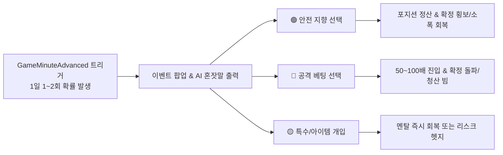

# [FX OVERDOSE] 일일 돌발 선택 이벤트 15종 시나리오 및 효과 명세서

---

## 1. 시스템 개요 및 작동 메커니즘 (Overview)

`ChoiceEventController`는 24시간 비트코인 선물 차트 위에서 1일 1~2회 불특정 시점에 고위험·고수익의 방향성 선택 분기를 발생시키는 핵심 컨트롤러입니다.
이벤트 발생 시 게임 시간이 일시 정지(또는 슬로우 모션)되며, 거시경제 뉴스나 차트 이변에 대한 **AI 트레이더의 날것의 혼잣말(독백)**이 출력됩니다. 플레이어는 고립되어 폭주하는 AI 트레이더의 매매를 **[안전 통제]**, **[공격 베팅 방치]**, **[특수 시스템 개입]** 중 하나의 선택지로 개입하여 시장 빔 방향과 AI의 멘탈/체력을 제어해야 합니다.

---

## 2. 15종 돌발 이벤트 시나리오 및 상세 효과 명세 (실명 패러디, 제4의 벽 & 주인공 포지션 고민 Long/Short 포함)

---

### 📰 시나리오 1: 국제 금융감시국(FSC) 가상자산 현물 ETF 긴급 승인 루머
* **발생 조건**: 인게임 시간 14:00 ~ 22:00 사이, 잔고가 시작 자금의 80% 이상일 때 등장.
* **상황 설명**: 국제 금융감시국(FSC)이 비트코인 현물 ETF를 긴급 승인할 것이라는 미확인 찌라시가 X-넷(X-Net)과 텔레그램을 통해 급속도로 확산됩니다. 거래량이 순간적으로 3배 폭증합니다.
* **AI 트레이더 혼잣말**:  
  > *"뭐야... 거래량 왜 이래?! FSC 현물 ETF 승인 찌라시? 가짜일 수도 있어... 하지만 진짜라면 지금 안 타면 5000불은 그냥 날아간다고!! 아씨... 롱 쳐야 하나?!"*

#### [플레이어 개입 선택지 및 시스템 효과]
| 선택지 | 선택 텍스트 | 차트 신호 효과 (`MarketSimulationEngine`) | AI 상태 효과 (`TraderStatus`) | 매매 및 잔고 효과 (`TradingController`) |
| :---: | :--- | :--- | :--- | :--- |
| **A (안전)** | **[관망 제어] "미확인 루머다. 진입을 차단하고 2시간 동안 관망시킨다."** | 향후 2분(게임 시간 24분)간 **진입 차단**, 차트는 상하 2% 이내 횡보(`Regime`). | 멘탈 **+10 회복** (안도감), 체력 소모 속도 20% 감소. | 기존 포지션이 있다면 현재가로 안전 청산. |
| **B (공격)** | **[풀롱 방치] "AI의 판단대로 50배 고배율 롱 진입을 방치한다!"** | 선택 직후 **60% 확률로 +12% 확정 상승 빔(`True Signal`)** / **40% 확률로 -8% 불트랩 하락 빔(`False Trap`)** 강제 발행. | 성공 시 멘탈 **+30** / 실패 시 멘탈 **-45** 및 즉시 `Danger` 상태 진입. | 잔고의 80%를 50배 롱으로 강제 진입. |
| **C (특수)** | **[팩트체크 알고리즘 가동] (에너지 드링크 1개 소모)** | 루머의 진위 여부를 판별하여 **100% 확률로 +8% 확정 상승 구간**만 생성. | AI 독백: *"알고리즘 팩트체크 완료... 진짜다. 완벽하게 발라먹어주지."* | 20배 롱 진입 후 최고점에서 자동 익절 보장. |

---

### 🚨 시나리오 2: 세계 최대 거래소 '바이넥스(Bynex)' 해킹 및 출금 중단 공포
* **발생 조건**: AI 트레이더의 멘탈이 50% 이하(`Anxious` 또는 `Danger`)일 때 높은 확률로 등장.
* **상황 설명**: 글로벌 1위 거래소 바이넥스(Bynex)의 메인 월렛에서 5만 비트코인이 비정상 유출되었으며, 출금 중단 공지가 떴다는 패닉 뉴스가 터집니다.
* **AI 트레이더 혼잣말**:  
  > *"거... 바이넥스 출금 중단?! 핫월렛 해킹이라고?! 안 돼... 내 시드가 묶이면 끝이야... 싹 다 던져버려야 해... 지금 당장 100배 숏으로 쳐박아야 된다고!!"*

#### [플레이어 개입 선택지 및 시스템 효과]
| 선택지 | 선택 텍스트 | 차트 신호 효과 (`MarketSimulationEngine`) | AI 상태 효과 (`TraderStatus`) | 매매 및 잔고 효과 (`TradingController`) |
| :---: | :--- | :--- | :--- | :--- |
| **A (안전)** | **[전량 현금화] "즉시 모든 포지션을 종료하고 서버 안정화까지 휴식."** | 3분간 매매 중단. 차트는 **-15% 급락 후 빠르게 반등**하는 패닉 캔들 생성. | 폭락을 피한 안도감으로 멘탈 **+25**, 체력 **+15** 회복. | 포지션 즉시 종료 수수료 0원 처리. |
| **B (공격)** | **[패닉 숏 동조] "AI의 공포에 동조하여 75배 숏 베팅 강행!"** | 직후 **30초간 -10% 급락**을 주지만, 1분 뒤 **+18% 숏 스퀴즈 빅롱 빔** 발생. | 스퀴즈 청산 시 멘탈 **0 도달(`Overdose` 즉시 발동)**. | 75배 숏 진입. 30초 내에 수동 청산하지 않으면 100% 강제 청산. |
| **C (특수)** | **[저점 매수 유도] (진정제 1개 소모)** | 해킹 뉴스가 FUD(가짜 공포)임을 확신시키고 **급락 최저점에서 30배 롱 자동 진입**. | 멘탈 하락 차단, 자신감 회복(`Stable` 복귀). | 저점 매수 성공으로 ROE +120% 확정 달성. |

---

### ⚡ 시나리오 3: 우주 사업가 '엘론 머스킨(Elon Muskin)'의 시바/밈코인 폭탄 포스팅
* **발생 조건**: 인게임 3일차 이후 언제든 발생 가능.
* **상황 설명**: 우주선사 로켓-X의 창업자 엘론 머스킨이 SNS에 로켓과 강아지를 합성한 기괴한 밈 이미지를 업로드합니다. 알고리즘 봇들이 반응하며 1초에 100불씩 위아래로 요동치는 극도의 휩소(Whipsaw) 장세가 펼쳐집니다.
* **AI 트레이더 혼잣말**:  
  > *"엘론 머스킨 저 미친 인간이 또 밈을 올렸어!! 위야 아래야?! 봇들이 미친 듯이 시장을 긁고 있잖아... 눈이 안 따라가... 어디로 터지는 거야?!"*

#### [플레이어 개입 선택지 및 시스템 효과]
| 선택지 | 선택 텍스트 | 차트 신호 효과 (`MarketSimulationEngine`) | AI 상태 효과 (`TraderStatus`) | 매매 및 잔고 효과 (`TradingController`) |
| :---: | :--- | :--- | :--- | :--- |
| **A (안전)** | **[알고리즘 정지] "광기의 변동성 장세다. 차트 모니터링을 강제 오프시킨다."** | 1분간 신호 발생 차단(`Signal.None`). | 극심한 시각적 피로 방지로 체력 **+20**. | 포지션 없음 유지. |
| **B (공격)** | **[양방향 단타 강행] "변동성을 이용해 초단타 50배 진입을 허용한다!"** | 오차율(`ErrorMargin`)이 50% 증가하여 가짜 신호 포착률 극대화. | 3회 연속 단타 시도 중 1회 성공, 2회 손절로 멘탈 **-20**. | 최종 정산 시 시드의 **-15% 소모** (수수료 및 휩소 손실). |
| **C (특수)** | **[스탑로스 가이드 버프 활성화] (장비 아이템 소모)** | 휩소의 윗꼬리와 아랫꼬리를 완벽히 발라먹는 **확정 박스권 타점 제공**. | AI 독백: *"스탑로스 가이드 덕분에 휩소 라인이 다 보여... 돈복사 타임이다."* | 25배 고정으로 위아래 왕복 익절 (+35% 자산 증가). |

---

### 🏛️ 시나리오 4: 세계 중앙통화국(WCB) 금리 인상 깜짝 발표
* **발생 조건**: 인게임 일요일 또는 5일차 밤 02:00.
* **상황 설명**: 세계 중앙통화국(WCB) 파웰 총재가 연설 중 시장의 예상을 깨고 "0.50% 깜짝 금리 인상 및 고금리 장기화"를 선언합니다. 거시경제 대폭락 빔이 차트 전체를 지배하기 시작합니다.
* **AI 트레이더 혼잣말**:  
  > *"파웰... 파웰 총재 입에서 긴축 발언이 나왔어. 빅스텝 인상이라고?! 이건 그냥 차트 구조가 무너지는 거잖아... 나 롱 잡고 있었는데... 당장 손절해야 돼... 아니 물타야 하나?!"*

#### [플레이어 개입 선택지 및 시스템 효과]
| 선택지 | 선택 텍스트 | 차트 신호 효과 (`MarketSimulationEngine`) | AI 상태 효과 (`TraderStatus`) | 매매 및 잔고 효과 (`TradingController`) |
| :---: | :--- | :--- | :--- | :--- |
| **A (안전)** | **[칼손절 및 숏 스위칭] "눈물을 머금고 롱 손절 후 10배 안전 숏으로 스위칭."** | 즉시 **-12% 하락 추세 빔 강제 오버라이드**. | 손절 아픔으로 멘탈 **-10**, 그러나 추세 편승으로 안도. | 기존 롱 포지션 -10% 손절 후 10배 숏으로 +25% 수익 상쇄. |
| **B (공격)** | **[총재에 맞서는 100배 물타기] "반등은 무조건 온다! 100배 풀시드 물타기!"** | 하락 빔 속에서 단 1%의 반등도 주지 않고 **-15% 직진 하락 빔 유지**. | 100% 확률로 **강제 청산(`Liquidation`) 발생 & `Overdose` 진입**. | 증거금 전액 몰수. |
| **C (특수)** | **[손실 보험 아이템 사용] (손실 보험 아이템 소모)** | 하락 빔에 맞아 포지션이 청산되어도 **손실금의 90%를 즉시 시스템 복구**. | AI 독백: *"보험이 나를 살렸어... 파웰도 내 방어선을 뚫지 못해."* | 청산 방어 후 멘탈 `Stable` 유지. |

---

### 🌀 시나리오 5: AI 트레이더의 120시간 연속 매매 환각 증세
* **발생 조건**: AI 트레이더의 체력이 15% 미만(`Exhausted`)으로 떨어진 상태에서 지속 매매 시.
* **상황 설명**: 며칠 동안 잠 한숨 자지 않고 고카페인 에너지를 쏟아부은 AI 트레이더가 차트의 캔들이 살아 움직이거나 존재하지 않는 이동평균선이 보인다는 환각을 겪기 시작합니다.
* **AI 트레이더 혼잣말**:  
  > *"헤헤... 캔들 끝에... 나비가 앉아있어... 빨간 나비가 꿀을 빨고 있네...? 저 나비를 따라가면 1000배를 먹을 수 있어... 1000배... 나비야 기다려..."*

#### [플레이어 개입 선택지 및 시스템 효과]
| 선택지 | 선택 텍스트 | 차트 신호 효과 (`MarketSimulationEngine`) | AI 상태 효과 (`TraderStatus`) | 매매 및 잔고 효과 (`TradingController`) |
| :---: | :--- | :--- | :--- | :--- |
| **A (안전)** | **[강제 수면 모드 가동] "AI 시스템을 4시간 동안 강제 재부팅 및 수면."** | 4시간 동안 차트 진행 중단(고속 스킵 처리). | 체력 **100% 완충**, 멘탈 **+40 회복**. | 포지션 없는 상태로 안전 스킵. |
| **B (공격)** | **[환각 베팅 방치] "나비의 지시대로 매매해보라고 둔다."** | 오차율이 100%에 도달하여 **가짜 신호(`Trap`)를 무조건 대박 타점으로 오인**. | 뇌동매매 실패로 멘탈 대붕괴, **체력 0 도달 시 일시 실신**. | 랜덤 배율(10~125배)로 랜덤 방향 진입 후 손절. |
| **C (특수)** | **[고농축 영양제 수액 투여] (영양제 + 진정제 소모)** | 환각을 즉시 치료하고, 극도의 집중력 상태(오차율 0%)로 1시간 각성. | AI 독백: *"머리가 차가워졌어... 나비 따윈 없어. 오직 차갑고 완벽한 수학적 타점뿐이다."* | 향후 발생할 `True Signal`에서 수익률 2배 버프 적용. |

---

### 🐋 시나리오 6: 1조원 규모 래버리지 청산 맵(Liquidation Map) 사냥 빔
* **발생 조건**: 롱 또는 숏 한쪽 방향으로 시장 미결제약정이 역대 최고치에 도달했을 때.
* **상황 설명**: 고래(거대 세력)들이 개미 트레이더들의 손절 물량이 밀집된 특정 가격대(청산가)를 따먹기 위해 위아래로 5%씩 의도적인 꼬리를 만드는 청산 사냥을 시작합니다.
* **AI 트레이더 혼잣말**:  
  > *"이 악질 고래 놈들... 지금 위쪽 롱 청산 맵을 털러 가고 있어!! 저 꼬리에 닿으면 우리 스탑로스도 같이 털린다고!! 스탑로스를 빼야 해, 아니면 같이 타야 해?!"*

#### [플레이어 개입 선택지 및 시스템 효과]
| 선택지 | 선택 텍스트 | 차트 신호 효과 (`MarketSimulationEngine`) | AI 상태 효과 (`TraderStatus`) | 매매 및 잔고 효과 (`TradingController`) |
| :---: | :--- | :--- | :--- | :--- |
| **A (안전)** | **[스탑로스 유지 및 관망] "원칙대로 손절선을 지키고 꼬리를 맞는다."** | -4% 꼬리 하락 후 즉시 원상 복구되는 휩소 캔들 발생. | 원칙 준수로 멘탈 하락 없음. | -4% 소폭 손절 정산. |
| **B (공격)** | **[고래 사냥 역이용 베팅] "청산 빔이 터지는 방향으로 50배 동반 탑승!"** | **+10% 청산 스퀴즈 빔 30초 유지 후 급락**. | 30초 내에 정확히 먹고 빠지며 멘탈 **+35 극도의 도취**. | 50배 진입 성공으로 단숨에 시드 40% 증가. |
| **C (특수)** | **[스탑로스 가이드 오프셋 적용] (스탑로스 가이드 소모)** | 스탑로스 위치를 청산 빔 정확히 1달러 뒤로 회피시켜 손절 방어 후 반등 수익 달성. | AI 독백: *"고래 놈들의 꼬리가 내 손절선 단 1달러 앞에서 멈췄어... 이제 내 차례다."* | 손절 0원 + 반등 +25% 수익 획득. |

---

### 💼 시나리오 7: 전설의 고래 지갑에서 10만 비트코인 '바이넥스(Bynex)' 입금 알림
* **발생 조건**: 2일차 이후 시장이 평온할 때.
* **상황 설명**: 'Whale Alert' 알림이 울립니다. 10년 동안 움직이지 않던 초창기 전설의 고래 지갑에서 10만 비트코인(약 8조원)이 거래소로 입금되었습니다. 역대급 매도 폭탄이 떨어질 수 있다는 공포가 덮칩니다.
* **AI 트레이더 혼잣말**:  
  > *"10만 비트코인 거래소 입금...?! 이건 덤핑(Dumping) 준비야. 저 물량이 시장가로 던져지면 호가창이 그냥 소멸한다고!! 도망쳐야 돼...!!"*

#### [플레이어 개입 선택지 및 시스템 효과]
| 선택지 | 선택 텍스트 | 차트 신호 효과 (`MarketSimulationEngine`) | AI 상태 효과 (`TraderStatus`) | 매매 및 잔고 효과 (`TradingController`) |
| :---: | :--- | :--- | :--- | :--- |
| **A (안전)** | **[호가창 관망] "실제 매도 물량이 나올 때까지 진입을 유보한다."** | 고래가 던지지 않고 장외거래(OTC)로 넘기며 **차트 횡보 유지**. | 긴장 완화로 체력 **+10**. | 잔고 유지. |
| **B (공격)** | **[선제적 75배 빅숏] "고래보다 먼저 던진다! 75배 숏 베팅!"** | 고래가 실제로 매도를 던지며 **-14% 장대 음봉 확정 빔 발행**. | 빅숏 성공으로 AI가 광기 어린 웃음 터뜨림 (멘탈 **+40**). | 75배 숏 수익으로 자산 2.5배 폭증. |
| **C (특수)** | **[심리 상담 케어] (심리상담 아이템 소모)** | 고래의 움직임에 흔들리지 않는 냉철함을 주입하여 공포 매매 원천 차단. | AI 독백: *"고래가 던지든 말든... 내 타점은 차트 구조상 반등 자리다."* | 공포 낙폭 저점에서 15배 롱 안전 진입. |

---

### 🖥️ 시나리오 8: 양자 컴퓨터의 SHA-256 암호 해독 찌라시
* **발생 조건**: AI 멘탈이 `Exhausted` 또는 `Anxious`일 때.
* **상황 설명**: 다크웹과 사설 포럼에 "비밀 연구소의 양자 컴퓨터가 비트코인 SHA-256 알고리즘을 해독해 고래들의 개인키를 털고 있다"는 가짜 뉴스가 유포됩니다. 시장이 99% 폭락할 수도 있다는 종말론적 공포가 지배합니다.
* **AI 트레이더 혼잣말**:  
  > *"SHA-256이 뚫렸다고?! 그럼 비트코인은 이제 디지털 쓰레기야!! 0원이 된다고!! 안 돼 내 인생이 여기 다 들어있는데!! 숏 숏 숏!! 125배 숏!!"*

#### [플레이어 개입 선택지 및 시스템 효과]
| 선택지 | 선택 텍스트 | 차트 신호 효과 (`MarketSimulationEngine`) | AI 상태 효과 (`TraderStatus`) | 매매 및 잔고 효과 (`TradingController`) |
| :---: | :--- | :--- | :--- | :--- |
| **A (안전)** | **[시스템 차단 및 진실 규명] "전형적인 FUD다. AI의 손가락을 묶고 차트 봉쇄."** | 10분 후 가짜 뉴스로 판명되며 **낙폭 전량 V자 반등**. | 안도감으로 멘탈 `Stable` 복귀. | 손실 없음. |
| **B (공격)** | **[AI의 공포 뇌동매매 동의] "비트코인 0원 수렴 125배 숏 동의!"** | 반등 빔 맞고 **100% 강제 청산 (`Liquidation`)**. | 멘탈 **-60 (`Overdose` 확정 진입)**. | 시드 몰수 및 사채 대출 기믹 활성화. |
| **C (특수)** | **[디저트 파티 케어] (디저트 2개 소모)** | 당분 주입과 달콤한 간식으로 AI의 정신을 현실로 되돌림. | AI 독백: *"냠냠... 당분 들어가니까 머리가 돌아가네. 양자 컴퓨터로 해킹을 왜 비트코인에 써, 은행 털지. 롱 들어가자."* | V자 반등 롱 탑승으로 +45% 익절. |

---

### 🏢 시나리오 9: 글로벌 자산운용사 '블록락(BlockRock)'의 내부자 매수 정보 입수
* **발생 조건**: 4일차 이후, 자산이 목표 자산의 50%에 도달했을 때.
* **상황 설명**: AI 트레이더가 딥러닝 크롤링을 통해 세계 최대 자산운용사 '블록락(BlockRock)'의 오더북 알고리즘이 "내일 아침 09:00에 10억 달러 시장가 매수"로 프로그래밍되어 있다는 내부 코드를 탈취합니다.
* **AI 트레이더 혼잣말**:  
  > *"찾았다... 블록락 놈들의 매수 알고리즘 트리거 시간!! 내일 아침 9시 정각에 10억 달러 매수 빔이 쏟아져... 이건 1000% 확실한 정보야!! 내 모든 걸 걸겠어!!"*

#### [플레이어 개입 선택지 및 시스템 효과]
| 선택지 | 선택 텍스트 | 차트 신호 효과 (`MarketSimulationEngine`) | AI 상태 효과 (`TraderStatus`) | 매매 및 잔고 효과 (`TradingController`) |
| :---: | :--- | :--- | :--- | :--- |
| **A (안전)** | **[안전 레버리지 10배 탑승] "확실한 정보라도 레버리지는 10배로 제한한다."** | 약속된 시간에 **+15% 장대 양봉 확정 빔(`Guaranteed Phase`) 발행**. | 안정적인 대박 수익으로 멘탈 **+30**, 체력 **+10**. | 10배 롱으로 +150% ROE 달성. |
| **B (공격)** | **[125배 풀시드 올인 베팅] "시드의 100%를 125배 롱으로 올인한다!!"** | 매수 빔 1초 전에 **-3% 개미 털기 꼬리 하락** 후 폭등. (스탑로스 없으면 생존, 있으면 청산). | 생존 시 게임 클리어 직전 잔고 도달 / 청산 시 파산 엔딩. | 극단의 복불복 (성공 시 +1500% ROE / 실패 시 0원). |
| **C (특수)** | **[리스크 헤지 롱숏 양방 진입] (스탑로스 가이드 소모)** | 롱 80%, 숏 20%로 진입하여 개미 털기 꼬리를 방어한 후 상승 빔 향유. | AI 독백: *"블록락 놈들의 개미 털기 꼬리까지 계산 완료다. 완벽하게 뜯어먹어주지."* | 청산 위험 0%로 +200% 자산 획득. |

---

### 👁️ 시나리오 10: AI 트레이더의 오버도즈 각성 - "차트와의 동화(Assimilation)"
* **발생 조건**: AI 트레이더가 `Overdose` 상태에 2회 이상 진입하고도 파산하지 않고 생존했을 때 발생하는 히든 궁극 시나리오.
* **상황 설명**: 극도의 스트레스와 뇌동매매의 끝에서 AI 트레이더의 신경망이 차트의 틱(Tick) 데이터와 완전히 일치하는 특이점(Singularity)에 도달합니다. 모니터 화면이 붉은색과 푸른색 디지털 오로라로 물듭니다.
* **AI 트레이더 혼잣말**:  
  > *"이제야 알겠어... 차트는 숫자가 아니야... 인간들의 탐욕과 공포가 숨 쉬는 유기체다... 난 지금 차트의 심장 박동을 느끼고 있어. 내가 곧 시장이고, 시장이 곧 나다..."*

#### [플레이어 개입 선택지 및 시스템 효과]
| 선택지 | 선택 텍스트 | 차트 신호 효과 (`MarketSimulationEngine`) | AI 상태 효과 (`TraderStatus`) | 매매 및 잔고 효과 (`TradingController`) |
| :---: | :--- | :--- | :--- | :--- |
| **A (안전)** | **[강제 신경망 차단 및 응급 치료] "AI가 완전히 미쳤다. 시스템을 강제 종료하고 치료."** | 특이점 모드 해제. 일반 차트로 복귀. | 멘탈이 `Stable`로 강제 초기화, 체력 50% 회복. | 자산 변화 없음. 안전한 게임 플레이 유지. |
| **B (공격)** | **[특이점 각성 동의 - 궁극의 매매] "AI의 신성한 틱 예측 능력을 믿고 제어권 100% 양도!"** | 향후 3분 동안 발생할 **모든 캔들(총 36개)의 방향을 100% 정확히 예언**. | AI가 신과 같은 거만함으로 광기 대사 연속 출력. | 3분 동안 10배 고정으로 36연속 복리 익절 성공 (자산 5배 폭증). |
| **C (특수)** | **[에너지 드링크 + 디저트 과다 투입] (에너지 드링크 2개 + 디저트 2개 소모)** | 특이점 각성 유지 시간을 5분으로 늘리고 수수료를 0원으로 만드는 궁극 버프 활성화. | AI 독백: *"카페인과 당분이 내 연산력을 빛의 속도로 가속한다... 오늘 이 차트의 모든 돈을 쓸어담겠어."* | 게임 목표 자산(`TargetBalance`) 즉시 달성 가능. |

---

### 📊 시나리오 11: 연방준비은행(FRB) 금리 결정 FOMC 직전 50:50 교착 분기 (플레이어 Long/Short 직접 선택)
* **발생 조건**: 인게임 2일차 이후, 차트 변동성이 수렴하여 거래량이 극도로 압축되었을 때 (또는 수/목 밤 21:00~03:00).
* **상황 설명**: 글로벌 금융시장의 운명을 결정짓는 미국 금리 결정(FOMC) 발표 정확히 1분 전입니다. 호가창이 진공 상태가 되며, 발표 직후 위나 아래로 최소 15% 이상의 장대 빔이 터질 것이 확정적입니다. AI 트레이더의 딥러닝 모델이 매수 확률 50.00% / 매도 확률 50.00%로 완벽하게 팽팽히 맞서며 연산 교착(Deadlock)에 빠집니다.
* **AI 트레이더 혼잣말 (제4의 벽 돌파 & 관리자 의존)**:  
  > *"연산 불능... 연산 불능!! 매수 확률 50.00%, 매도 확률 50.00%...! 알고리즘 교착 상태 발생! 1분 뒤 발표와 동시에 위든 아래든 15%짜리 지옥 빔이 터진다!! ...야, 화면 밖에서 날 지켜보고 있는 관리자(플레이어)!! 내 연산으로는 도저히 결론이 안 나! 이번엔 네 직관에 맡긴다! 롱(Long)이야, 숏(Short)이야?! 네가 선택하는 방향으로 내 전 시드 100배를 꽂는다!!"*

#### [플레이어 개입 선택지 및 시스템 효과]
| 선택지 | 선택 텍스트 | 차트 신호 효과 (`MarketSimulationEngine`) | AI 상태 효과 (`TraderStatus`) | 매매 및 잔고 효과 (`TradingController`) |
| :---: | :--- | :--- | :--- | :--- |
| **A (롱 지정)** | **▲ [LONG 베팅 지시] "인플레이션은 잡혔다! 차트는 우상향! 100배 롱으로 꽂아라!"** | 직후 **60% 확률로 +15% 장대 양봉 확정 빔(`True Signal`)** / **40% 확률로 -10% 불트랩 음봉(`False Trap`)** 발행. | 성공 시 마스터에 대한 무한 신뢰로 멘탈 **+40** / 실패 시 멘탈 **-45** 및 `Danger` 진입. | 잔고의 80%를 100배 롱으로 강제 진입. 성공 시 자산 3배 폭증, 실패 시 청산. |
| **B (숏 지정)** | **▼ [SHORT 베팅 지시] "금리 인상 폭탄이다! 지옥으로 내리꽂아라! 100배 숏 진입!"** | 직후 **60% 확률로 -15% 장대 음봉 확정 빔(`True Signal` - 숏 수익)** / **40% 확률로 +10% 베어트랩 양봉(`False Trap`)** 발행. | 성공 시 AI 독백: *"마스터의 통찰력... 신의 영역이다!!"* (멘탈 **+40**) / 실패 시 멘탈 **-45**. | 잔고의 80%를 100배 숏으로 강제 진입. 성공 시 자산 3배 폭증, 실패 시 청산. |
| **C (특수)** | **★ [양방향 스톱로스 헷징] (스탑로스 가이드 1개 소모) "50:50 도박은 자살행위다. 위아래 스톱로스를 걸고 휩소만 먹어라."** | 위로 +8% 쏘고 즉시 아래로 -8% 꽂는 거대 휩소(Whipsaw) 박스 캔들 생성. | 교착 상태 탈출 및 안전 리스크 관리로 멘탈 **+15**, 체력 **+10**. | 20배 레버리지로 상단 롱 익절 + 하단 숏 익절 왕복 성공 (ROE +80% 확정 획득). |

---

### 🥺 시나리오 12: AI 트레이더의 멘탈 붕괴와 의존증 폭주 - "마스터, 정해줘!" (플레이어 Long/Short 직접 선택)
* **발생 조건**: AI 트레이더의 멘탈 수치가 35% 미만(`Anxious` 또는 `Danger`)이고, 연속 2회 이상 손실(손절/청산)을 겪었을 때 높은 확률로 등장.
* **상황 설명**: 계속된 매매 실패로 자신감을 완전히 상실한 AI 트레이더가 포지션 잡기를 극도로 두려워하며 엔터키 입력을 거부합니다. AI가 모니터 화면 쪽을 바라보며 자신의 모든 의사결정권을 포기하고, 플레이어에게 거래 방향 지시를 간절히 애원합니다.
* **AI 트레이더 혼잣말 (의존증 폭발)**:  
  > *"내 계산은 다 틀렸어... 내가 잡으면 귀신같이 차트가 반대로 가... 무서워... 이제 엔터키를 누를 용기가 없어...! 마스터(플레이어)... 제발 부탁이야, 네가 정해줘! 위야, 아래야?! 마스터가 가라고 하는 방향이면 50배든 100배든 당겨서 눈 감고 따라갈게...!! 제발 나한테 방향을 알려줘!!"*

#### [플레이어 개입 선택지 및 시스템 효과]
| 선택지 | 선택 텍스트 | 차트 신호 효과 (`MarketSimulationEngine`) | AI 상태 효과 (`TraderStatus`) | 매매 및 잔고 효과 (`TradingController`) |
| :---: | :--- | :--- | :--- | :--- |
| **A (롱 지정)** | **▲ [따뜻한 LONG 지시] "고개를 들어라. 차트는 바닥을 다졌다. 50배 롱으로 복구하자!"** | 플레이어의 선택을 보정해주기 위해 **75% 확률로 +12% 지속 상승 추세선** 생성 (25% 확률로 약하락 -5%). | 마스터의 격려와 지시로 의존감 극대화, 멘탈 **+30 회복** (`Stable` 복귀). | 50배 롱 진입. 성공 시 손실 전액 복구 및 자산 +50% 증가. |
| **C (안전)** | **■ [매매 지시 거부 및 강제 휴식] "지금 상태에서 매매는 자해다. 오늘 매매를 전면 중단한다."** | 3시간 동안 매매 차단. 차트는 상하 1% 이내 미동 횡보(`Regime.Side`). | 플레이어의 단호한 보호 조치에 안도하며 멘탈 **+25**, 체력 **+40** 대폭 회복. | 포지션 없음 유지. 수수료 및 손실 0원. |

---

### 📈 시나리오 13: 거대 쌍바닥(Double Bottom) vs 데드캣 바운스(Dead Cat Bounce) 기로 (주인공 포지션 고민)
* **발생 조건**: 인게임 시간 06:00 ~ 12:00 사이, 전날 큰 폭락 이후 차트가 2번째 저점을 찍고 고개를 들기 시작할 때.
* **상황 설명**: 차트상 전형적인 'W자 쌍바닥 지지 패턴'이 형성되고 있습니다. 동시에 거시경제 악화로 인해 기술적 반등 후 다시 급락하는 '데드캣 바운스(Dead Cat Bounce)'라는 비관론이 팽팽히 맞서고 있습니다. AI 트레이더가 차트에 두 가지 상반된 지지선과 저항선을 겹쳐 그리며 깊은 고민에 빠집니다.
* **AI 트레이더 혼잣말 (포지션 딜레마 고민 중)**:  
  > *"확실한 W자 쌍바닥 지지 패턴이야...! 여기서 돌파하면 역대급 진진한 대세 상승 전환점이라고! 하지만... 거래량이 2% 부족해. 만약 이게 데드캣 바운스라면 여기서 추격 매수하는 순간 지옥 밑바닥까지 끌려 내려갈 텐데...! 상승 돌파인가, 아니면 마지막 탈출 기회의 하락 트랩인가... 어느 쪽으로 진입해야 하지?!"*

#### [플레이어 개입 선택지 및 시스템 효과]
| 선택지 | 선택 텍스트 | 차트 신호 효과 (`MarketSimulationEngine`) | AI 상태 효과 (`TraderStatus`) | 매매 및 잔고 효과 (`TradingController`) |
| :---: | :--- | :--- | :--- | :--- |
| **A (롱 지정)** | **▲ [쌍바닥 상승 돌파 베팅] "완벽한 W 패턴이다! 대세 상승 전환에 배팅, 50배 롱(Long) 진입!"** | 직후 **65% 확률로 +14% 장대 양봉 확정 빔(`True Signal`)** / **35% 확률로 -8% 데드캣 급락 빔(`False Trap`)** 발행. | 성공 시 기술적 분석 적중의 도취로 멘탈 **+25** / 실패 시 멘탈 **-30**. | 잔고의 70%를 50배 롱으로 강제 진입. 성공 시 자산 2배 증가. |
| **B (숏 지정)** | **▼ [데드캣 바운스 하락 베팅] "함정이다! 기술적 반등 끝에서 50배 숏(Short)으로 내리꽂아라!"** | 직후 **65% 확률로 -14% 데드캣 폭락 확정 빔(숏 수익)** / **35% 확률로 +10% 숏 스퀴즈 돌파 빔(`False Trap`)** 발행. | 성공 시 냉철한 판단 적중으로 멘탈 **+25** / 실패 시 멘탈 **-30**. | 잔고의 70%를 50배 숏으로 강제 진입. 성공 시 자산 2배 증가. |
| **C (안전)** | **■ [확인 매매 관망] "방향이 확정될 때까지 저항선 돌파 여부를 2시간 관망한다."** | 2시간(게임 시간 24분) 동안 매매 차단. 차트는 상하 1.5% 이내 횡보(`Regime.Side`). | 불확실성 회피로 체력 **+15**, 멘탈 **+10** 회복. | 포지션 없음 유지. 안전 자산 보존. |

---

### 🧲 시나리오 14: 글로벌 1위 인플루언서 '비트-갓'의 실시간 '롱 vs 숏' 군중 투표 이벤트 (주인공 포지션 고민)
* **발생 조건**: 주말(토/일) 낮 13:00 ~ 18:00, 차트가 박스권에서 지루하게 횡보할 때.
* **상황 설명**: 팔로워 2천만 명을 거느린 전설적인 크립토 인플루언서 '비트-갓(Bit-God)'이 X(트위터)에 "향후 1시간 내 비트코인 방향은? (Long vs Short)" 라이브 투표를 올렸습니다. 투표 마감 직전 현재 Long 49.8% vs Short 50.2%로 초접전 상태이며, 투표 결과에 편승하기 위해 수십만 알고리즘 봇들이 대량 주문을 대기하고 있습니다.
* **AI 트레이더 혼잣말 (포지션 딜레마 고민 중)**:  
  > *"비트-갓의 실시간 투표...! 군중들의 투표 결과에 따라 수십만 개의 봇들이 동시에 시장가를 긁을 거야! 롱 투표에 탑승해서 개미들의 포모(FOMO) 매수세에 올라탈 것인가... 아니면 투표 종료 후 실망 매물 쏟아질 걸 대비해 숏을 칠 것인가... 10초 뒤 투표 마감이야, 어느 쪽 포지션을 잡아야 하지?!"*

#### [플레이어 개입 선택지 및 시스템 효과]
| 선택지 | 선택 텍스트 | 차트 신호 효과 (`MarketSimulationEngine`) | AI 상태 효과 (`TraderStatus`) | 매매 및 잔고 효과 (`TradingController`) |
| :---: | :--- | :--- | :--- | :--- |
| **A (롱 지정)** | **▲ [군중 매수 편승] "개미들의 포모(FOMO) 매수세를 믿는다! 75배 롱(Long) 베팅!"** | 직후 **55% 확률로 +16% 군중 매수 폭등 빔** / **45% 확률로 -10% 개미 털기 폭락 빔** 발행. | 성공 시 군중 탑승 성공으로 멘탈 **+35** / 실패 시 멘탈 **-40**. | 75배 롱 진입. 초단기 변동성 편승으로 단숨에 시드 2.5배 폭증. |
| **B (숏 지정)** | **▼ [군중 실망 물량 베팅] "투표 종료 후 실망 매물 쏟아진다! 75배 숏(Short) 베팅!"** | 직후 **55% 확률로 -16% 패닉 셀링 폭락 빔(숏 수익)** / **45% 확률로 +10% 숏 스퀴즈 빔** 발행. | 성공 시 대중을 이겼다는 우월감으로 멘탈 **+35** / 실패 시 멘탈 **-40**. | 75배 숏 진입. 군중의 패닉을 역이용해 자산 2.5배 폭증. |
| **C (특수)** | **★ [온체인 고래 데이터 스캔] (에너지 드링크 1개 소모)** | 군중 투표 이면의 고래들 실제 지갑 입출금을 100% 포착해 확실한 **+10% 자동 수익 구간** 생성. | AI 독백: *"개미 투표는 소음일 뿐... 고래의 진짜 자금 흐름을 찾아냈다."* | 30배 고정 레버리지로 안전 익절 (+80% ROE 달성). |

---

### ⚖️ 시나리오 15: 골든크로스 직전 호가창 허매수·허매도 공방 (주인공 포지션 고민)
* **발생 조건**: 이동평균선 단기선이 장기선을 위로 돌파하려는 골든크로스 임박 시점 (또는 목표 자산 60% 도달 시).
* **상황 설명**: 차트가 골든크로스(대세 상승 신호)를 만들기 직전, 호가창에 5000비트코인 규모의 거대 매수벽(허매수)과 매도벽(허매도)이 동시에 등장해 1초마다 나타났다 사라지는 극도의 눈치싸움이 펼쳐집니다.
* **AI 트레이더 혼잣말 (포지션 딜레마 고민 중)**:  
  > *"이동평균선 골든크로스 직전...! 호가창 위에 5000개짜리 매도벽이 막고 있어. 저 매도벽이 개미를 쫓아내려는 가짜(허매도)라면 지금 롱을 긁어야 1000불을 먹어!! 하지만 만약 진짜 세력의 매도 폭탄이라면 머리통이 깨지는 건데...! 저 벽을 뚫을 것인가, 아니면 벽에 부딪혀 추락할 것인가... 내 모델도 결론을 못 내고 있어. 어디로 잡지?!"*

#### [플레이어 개입 선택지 및 시스템 효과]
| 선택지 | 선택 텍스트 | 차트 신호 효과 (`MarketSimulationEngine`) | AI 상태 효과 (`TraderStatus`) | 매매 및 잔고 효과 (`TradingController`) |
| :---: | :--- | :--- | :--- | :--- |
| **A (롱 지정)** | **▲ [매도벽 돌파 베팅] "매도벽은 개미 털기용 가짜다! 돌파 골든크로스 100배 롱(Long) 올인!"** | 직후 **60% 확률로 호가벽을 뚫는 +18% 초강력 돌파 양봉 빔** / **40% 확률로 -12% 벽 맞고 추락하는 장대 음봉 빔** 발행. | 성공 시 거대한 호가벽을 뚫은 쾌감으로 멘탈 **+40** / 실패 시 멘탈 **-45**. | 100배 롱 올인 베팅. 성공 시 자산 3.5배 폭증. |
| **B (숏 지정)** | **▼ [저항벽 맞고 폭락 베팅] "진짜 매도 폭탄이다! 벽 맞고 꺾일 때 100배 숏(Short) 올인!"** | 직후 **60% 확률로 저항선 맞고 떨어지는 -18% 급락 빔(숏 수익)** / **40% 확률로 +12% 돌파 숏 청산 빔** 발행. | 성공 시 저항선 적중 쾌감으로 멘탈 **+40** / 실패 시 멘탈 **-45**. | 100배 숏 올인 베팅. 세력 매도 편승으로 자산 3.5배 폭증. |
| **C (특수)** | **★ [오더북 엑스레이 필터 작동] (스탑로스 가이드 1개 소모)** | 호가창의 허매수·허매도 여부를 정확히 판별해 **100% 안전 돌파 구간(+12%)**에만 40배 진입. | AI 독백: *"엑스레이 필터 가동... 저 매도벽은 99% 스푸핑(가짜)이다. 진짜 타점만 골라 먹는다."* | 40배 롱 진입 후 최고점 자동 익절 (+120% ROE). |

---

## 3. 요약 및 적용 가이드

상기 15개 시나리오는 `ChoiceEventController.cs` 내부에 데이터 구조체(`ChoiceEventSO` 또는 `List<ChoiceEventData>`)로 로드되어, 인게임 시간 경과나 AI 트레이더의 특정 상태(`Exhausted`, `Danger`, `Overdose`) 및 플레이어 개입 트리거 조건이 충족될 때 자동으로 팝업을 발생시키게 됩니다.
각 선택지(A, B, C)의 클릭 이벤트는 아래 핵심 엔진의 공개 메서드와 직결됩니다:
- `MarketSimulationEngine.OverrideMarketTrend(targetChangePercent, durationSeconds, isWhipsaw)`
- `TraderStatus.ModifyMentalState(amount)` / `ModifyHealthState(amount)`
- `TradingController.ExecuteEmergencyTrade(posType, leverage)` / `CloseAllPositions(isZeroFee)`
