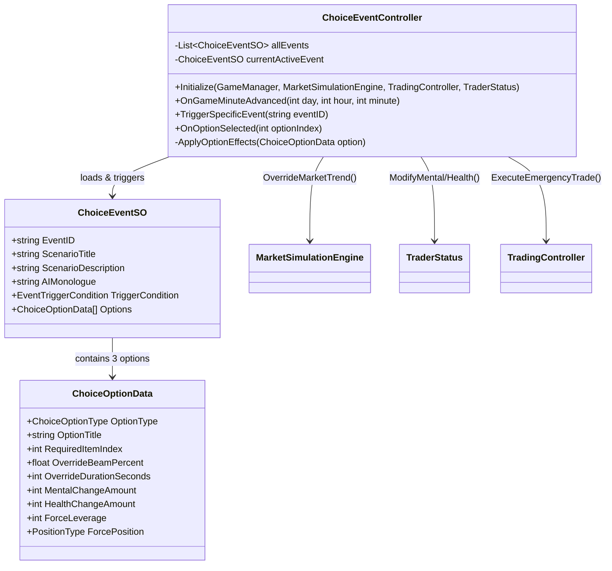

# [FX OVERDOSE] 돌발 선택 이벤트 시스템 구현 및 메서드 명세서

---

## 1. 시스템 아키텍처 및 설계 개요

돌발 선택 이벤트 시스템은 **데이터 계층(`ChoiceEventSO` & `ChoiceOptionData`)**, **중앙 제어 계층(`ChoiceEventController`)**, **UI 표현 계층(`ChoiceEventPopupUIController`)**, 그리고 **엔진 연동 계층(`MarketSimulationEngine`, `TraderStatus`, `TradingController`)**으로 분리되어 구현됩니다.



---

## 2. 데이터 구조체 명세 (`ChoiceEventSO.cs` & `ChoiceOptionData.cs`)

### 📌 `ChoiceOptionData` (클래스)
개별 선택지(A: 안전, B: 공격, C: 특수 아이템 개입)의 기획 및 효과 수치를 정의하는 직렬화 가능 클래스입니다.

| 멤버 변수명 | 타입 | 설명 및 역할 |
| :--- | :--- | :--- |
| `OptionType` | `ChoiceOptionType` (Enum) | 선택지 유형 (`Safe`, `Aggressive`, `SpecialItem`, `DirectionalLong`, `DirectionalShort`) |
| `OptionTitle` | `string` | 선택지 버튼에 표시될 요약 문구 (예: `"[관망 제어] 진입 차단 및 관망"`, `"▲ [LONG 베팅 지시] 100배 롱으로 꽂아라!"`) |
| `Description` | `string` | 선택 시 발생할 예상 행동 설명 |
| `RequiredItemIndex` | `int` | 특수 개입 시 필요한 아이템 인덱스 (`-1`이면 불필요, `0`~`3`이면 4대 아이템군) |
| `RequiredItemCount` | `int` | 필요한 아이템 수량 (기본값 `1`) |
| `OverrideSignalProbTrue`| `float` | 진입 성공 확률 (`1.0f` = 100% 확정 익절 빔, `0.0f` = 100% 청산 트랩) |
| `OverrideBeamPercent` | `float` | 차트 가격 오버라이드 강제 변동률 (`+12.0f` = +12% 상승, `-15.0f` = -15% 하락) |
| `OverrideDurationSeconds`| `int` | 확정 빔 또는 진입 제한 유지 시간 (인게임 초 기준) |
| `MentalChangeAmount` | `int` | 선택 직후 또는 빔 정산 후 AI 멘탈 증감 수치 (`+25`, `-45` 등) |
| `HealthChangeAmount` | `int` | AI 체력/피로도 증감 수치 |
| `ForceLeverage` | `int` | 강제 진입할 레버리지 배율 (`0`이면 기존 유지, `50`~`125`면 고배율 강제 진입) |
| `ForcePosition` | `PositionType` (Enum) | 강제 포지션 방향 (`Long`, `Short`, `None`=청산/관망) |

---

### 📌 `ChoiceEventSO` (ScriptableObject)
10종의 시나리오를 각각 별도의 애셋 파일로 생성하여 관리하는 ScriptableObject입니다.

| 멤버 변수명 | 타입 | 설명 및 역할 |
| :--- | :--- | :--- |
| `EventID` | `string` | 이벤트 고유 식별자 (예: `"EVENT_01_FSC_ETF"`, `"EVENT_02_BYNEX_HACK"`) |
| `ScenarioTitle` | `string` | 이벤트 뉴스 헤드라인 (예: `"국제 금융감시국(FSC) 현물 ETF 승인 루머"`) |
| `ScenarioDescription` | `string` | 거시경제 또는 차트 이변 상황 상세 설명 텍스트 |
| `AIMonologue` | `string` | AI 트레이더가 차트를 보며 떨거나 광기 어린 혼잣말을 하는 멘헤라 독백 |
| `TriggerCondition` | `EventTriggerCondition` | 등장 조건 Enum (`TimeOfDay`, `LowMental`, `HighLeverage`, `Any`) |
| `Options` | `ChoiceOptionData[]` | 3분기 선택지 배열 (`A`, `B`, `C` 옵션) |

---

## 3. 중앙 컨트롤러 메서드 명세 (`ChoiceEventController.cs`)

### 1️⃣ 초기화 및 이벤트 구독
```csharp
public void Initialize(GameManager gm, MarketSimulationEngine market, TradingController trading, TraderStatus status)
```
* **역할**: 게임 시작 시(`GameManager.Start()`) 호출되어 주요 시스템 의존성을 주입받고, 하루 1~2회 발생 타임을 계산합니다.
* **로직**: `GameManager.OnGameMinuteAdvanced` 이벤트 구독 및 오늘 이벤트가 터질 목표 시간(예: 14시 30분, 21시 15분)을 난수로 설정합니다.

---

### 2️⃣ 시간 트리거 및 조건 검증
```csharp
private void OnGameMinuteAdvanced(int day, int hour, int minute)
```
* **역할**: 인게임 시간이 1분 흘러갈 때마다 호출되어, 현재 시간에 돌발 이벤트를 발생시킬지 판단합니다.
* **로직**: 오늘 이미 2회 이벤트가 발생했으면 리턴. 목표 시간에 도달했거나 AI 멘탈이 15% 이하(`Overdose`/`Danger`)일 때 비상 트리거를 가동합니다.

```csharp
private bool CheckEventConditions(ChoiceEventSO eventSO)
```
* **역할**: 후보 이벤트(`eventSO`)가 현재 인게임 자산, AI 상태, 시간 조건에 부합하는지 검증합니다.
* **반환값**: 조건 일치 시 `true`, 불일치 시 `false`.

---

### 3️⃣ 이벤트 호출 및 UI 일시정지
```csharp
public void TriggerRandomEvent()
```
* **역할**: 조건에 맞는 `ChoiceEventSO` 리스트 중 하나를 랜덤 추출하여 팝업을 띄웁니다.

```csharp
public void TriggerSpecificEvent(string eventID)
```
* **역할**: 특정 `EventID`를 지정하여 즉시 실행합니다. (개발 중 치트, 테스트 및 히든 10번 각성 시나리오 호출용)

```csharp
private void ShowChoiceDialog(ChoiceEventSO eventData)
```
* **역할**: 이벤트를 화면에 렌더링하고 차트 진행을 일시 정지시킵니다.
* **로직**: 
  1. `GameManager.PauseGameTime(true)` 호출하여 캔들 갱신 정지.
  2. `ChoiceEventPopupUIController.Show(eventData, OnOptionSelected)`를 호출하여 뉴스 타이틀, 상황 설명, AI 독백, 3개 버튼 텍스트 바인딩.

---

### 4️⃣ 선택지 입출력 및 효과 적용
```csharp
public void OnOptionSelected(int optionIndex)
```
* **역할**: 플레이어가 팝업 UI에서 A(`0`), B(`1`), C(`2`) 중 하나를 클릭했을 때 실행되는 핵심 콜백입니다.
* **매개변수**: `optionIndex` (선택된 옵션 번호 0~2)
* **로직**:
  1. 선택된 옵션이 C(특수 아이템 요구)인 경우, `TraderStatus.ConsumeItem(RequiredItemIndex, RequiredItemCount)`를 검증합니다. 아이템이 부족하면 UI에 경고 메시지를 띄우고 취소합니다.
  2. 아이템 검증 통과 시 팝업 창을 닫고, `GameManager.PauseGameTime(false)`로 게임 시간을 다시 흐르게 합니다.
  3. `ApplyOptionEffects(currentActiveEvent.Options[optionIndex])` 호출.

```csharp
private void ApplyOptionEffects(ChoiceOptionData option)
```
* **역할**: 선택지 데이터(`ChoiceOptionData`)의 수치를 3대 핵심 엔진에 즉각 분배하여 오버라이드합니다.
* **상세 연동 순서**:
  1. **AI 상태 변경 (`TraderStatus`)**:
     - `traderStatus.ModifyMentalState(option.MentalChangeAmount)`
     - `traderStatus.ModifyHealthState(option.HealthChangeAmount)`
  2. **[NEW] 플레이어 직접 방향 지정 (`DirectionalLong` / `DirectionalShort`) 판정 분기**:
     - `option.OptionType == ChoiceOptionType.DirectionalLong` 또는 `DirectionalShort`인 경우, `ExecutePlayerDirectionalChoice(option)`를 호출하고 로직을 종료합니다.
  3. **기존 매매 제어 (`TradingController`)**:
     - `option.ForcePosition == PositionType.None`이면 → 즉시 `tradingController.CloseAllPositions()` (안전 정산).
     - `option.ForceLeverage > 0`이면 → `tradingController.ExecuteEmergencyTrade(option.ForcePosition, option.ForceLeverage)` (강제 진입).
  4. **차트 강제 오버라이드 (`MarketSimulationEngine`)**:
     - `StartCoroutine(ExecuteDelayedMarketBeam(option))` 비동기 코루틴 실행.

```csharp
private void ExecutePlayerDirectionalChoice(ChoiceOptionData option)
```
* **역할**: 플레이어가 Long 또는 Short 방향을 직접 선택했을 때(`DirectionalLong` / `DirectionalShort`), 매매 방향을 즉시 강제 진입시키고 차트 빔의 성공/실패 여부를 확률에 따라 동적 생성합니다.
* **로직**:
  1. `PositionType playerChosenPos = option.ForcePosition;` 방향 및 `option.ForceLeverage` 배율로 `tradingController.ExecuteEmergencyTrade(playerChosenPos, option.ForceLeverage)` 즉시 진입.
  2. `Random.value <= option.OverrideSignalProbTrue` 조건으로 성공 여부(`isSuccess`) 판정.
  3. **성공 시**: 진입 방향과 일치하는 빔 생성 (`playerChosenPos == PositionType.Long ? Mathf.Abs(option.OverrideBeamPercent) : -Mathf.Abs(option.OverrideBeamPercent)`).
  4. **실패 시 (불트랩/베어트랩 발동)**: 진입 방향의 반대쪽으로 청산 빔 생성 (`option.OverrideBeamPercent * 0.7f` 손절 유도) 및 추가 멘탈 페널티 적용(`traderStatus.ModifyMentalState(-20f)`).

```csharp
private IEnumerator ExecuteDelayedMarketBeam(ChoiceOptionData option)
```
* **역할**: 선택 후 차트가 자연스럽게 움직이다가, 지정된 변동률(`OverrideBeamPercent`)의 확정 빔(양봉/음봉/휩소)을 생성하도록 연계합니다.
* **로직**: `marketEngine.OverrideMarketTrend(option.OverrideBeamPercent, option.OverrideDurationSeconds)` 호출.

---

## 4. 연동 대상 타 스크립트 확장 메서드 명세

돌발 이벤트의 명령을 수행하기 위해 기존 스크립트들에 추가/확장될 인터페이스 메서드 목록입니다.

### 🔌 `MarketSimulationEngine.cs` 확장
```csharp
public void OverrideMarketTrend(float targetChangePercent, int durationSeconds, bool isWhipsaw = false)
```
* **기능**: 차트 난수 생성기(`Signal.None/True/False`)를 일시 중단하고, `durationSeconds` 동안 목표 가격까지 정확히 도달하는 강제 빔(`Guaranteed Phase`)을 캔들에 주입합니다.

---

### 🔌 `TraderStatus.cs` 확장
```csharp
public void ModifyMentalState(float amount)
public void ModifyHealthState(float amount)
public bool ConsumeItem(int itemIndex, int count)
```
* **기능**: 돌발 이벤트 결과 및 아이템 섭취에 따라 멘탈/체력 수치를 즉시 가감하고, 상태(`Stable` ~ `Overdose`)를 즉각 재갱신합니다. `ConsumeItem`은 인벤토리 수량을 확인하고 차감 성공 시 `true`를 반환합니다.

---

### 🔌 `TradingController.cs` 확장
```csharp
public void ExecuteEmergencyTrade(PositionType posType, int leverage)
public void CloseAllPositions(bool isZeroFee = false)
```
* **기능**: AI 또는 돌발 이벤트의 강제 선택에 따라 현재 잔고를 기반으로 즉각 포지션을 개시하거나, 수수료 면제 버프를 적용하여 전량 정산합니다.

---

## 5. 구현 단계별 체크리스트

- [ ] **1단계**: `ChoiceOptionData` 및 `ChoiceEventSO` C# 스크립트 작성 (`ChoiceOptionType`에 `DirectionalLong`, `DirectionalShort` 추가)
- [ ] **2단계**: 15종 돌발 선택 이벤트 ScriptableObject 애셋(`EVENT_01` ~ `EVENT_15`) 유니티 Editor 생성 및 데이터 입력 (플레이어 Long/Short 직접 선택 5종 포함)
- [ ] **3단계**: `ChoiceEventController` 코어 엔진 작성 (시간 트리거, Long/Short 직접 선택 방향 판정 `ExecutePlayerDirectionalChoice` 및 효과 적용 분기 로직)
- [ ] **4단계**: `MarketSimulationEngine`에 `OverrideMarketTrend` 확정 빔 주입 메서드 구현
- [ ] **5단계**: `TraderStatus` 및 `TradingController`와 선택 분기(`ApplyOptionEffects`) 최종 통합 검증
