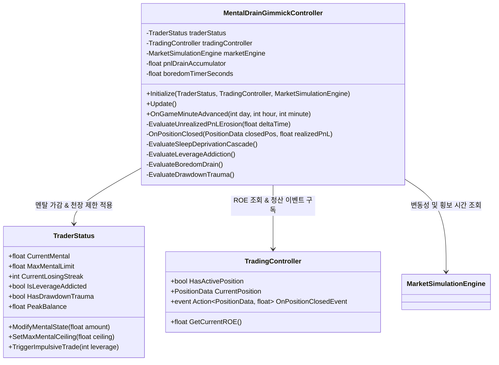

# [FX OVERDOSE] AI 트레이더 상시 멘탈 소모 기믹 시스템 구현 및 메서드 계획서

---

## 1. 시스템 아키텍처 및 설계 개요

상시 멘탈 소모 기믹 시스템은 기존의 돌발 선택 이벤트(`ChoiceEventController`)와 독립적으로 작동하며, **실시간 프레임(`Update`) 주기**와 **인게임 분 경과(`OnGameMinuteAdvanced`) 주기**를 병행하여 AI의 심리 상태를 계산하는 `MentalDrainGimmickController`로 통합 구현됩니다.



---

## 2. 데이터 구조체 및 상태 변수 명세 (`TraderStatus.cs` 확장)

6대 기믹의 상태를 기억하고 계산하기 위해 `TraderStatus` 내부에 확장될 필드 및 속성 목록입니다.

| 변수명 / 속성명 | 타입 | 초기값 | 설명 및 역할 |
| :--- | :--- | :--- | :--- |
| `MaxMentalLimit` | `float` | `100.0f` | 드로다운 트라우마 발생 시 제한되는 멘탈 천장 수치 (기본 100, 트라우마 시 80 / 60 / 45 캡) |
| `CurrentLosingStreak` | `int` | `0` | 연속 손절 횟수 카운터. 수익 청산 시 `0`으로 리셋, 손실 청산 시 `++` |
| `IsLeverageAddicted` | `bool` | `false` | 고배율 중독 패시브 상태 여부. 50배 이상 3연승 시 `true`, 진정제/수면 시 `false` |
| `ConsecutiveHighLevWins`| `int` | `0` | 50배 이상 연속 익절 카운터 (3 도달 시 중독 발동) |
| `HasDrawdownTrauma` | `bool` | `false` | 역대 고점 대비 20% 이상 하락 시 활성화되는 트라우마 패시브 여부 |
| `PeakBalance` | `float` | `StartBalance` | 게임 플레이 중 달성한 역대 최고 자산(High Water Mark) 수치 |
| `CurrentDrawdownPercent`| `float` | `0.0f` | `(PeakBalance - CurrentBalance) / PeakBalance * 100f` 실시간 드로다운 비율 |

---

## 3. 중앙 제어 메서드 명세 (`MentalDrainGimmickController.cs`)

### 1️⃣ 초기화 및 이벤트 구독
```csharp
public void Initialize(TraderStatus status, TradingController trading, MarketSimulationEngine market)
```
* **역할**: 게임 로드 시 각 의존성을 주입받고, 포지션 청산 이벤트 및 시간 경과 이벤트를 구독합니다.
* **로직**:
  - `tradingController.OnPositionClosedEvent += OnPositionClosed;`
  - `GameManager.Instance.OnGameMinuteAdvanced += OnGameMinuteAdvanced;`

---

### 2️⃣ 실시간 틱 연산 (매 프레임 호출 - 미실현 손익 침식)
```csharp
private void Update()
```
* **역할**: 매 프레임 실행되면서 포지션이 있을 경우 미실현 손익(ROE)에 따른 멘탈 침식(`EvaluateUnrealizedPnLErosion`)을 수행합니다.

```csharp
private void EvaluateUnrealizedPnLErosion(float deltaTime)
```
* **로직**:
  1. `tradingController.HasActivePosition`이 `false`면 리턴.
  2. `float roe = tradingController.GetCurrentROE();` 조회.
  3. `roe > -5.0f`이면 리턴.
  4. 손실 구간별 초당 침식 속도(`drainRate`) 계산:
     - `-10f < roe <= -5f` → `drainRate = 0.01f`
     - `-20f < roe <= -10f` → `drainRate = 0.05f`
     - `roe <= -20f` → `drainRate = 0.15f`
  5. `traderStatus.ModifyMentalState(-drainRate * deltaTime);` 호출.
  6. `roe <= -20f` 지속 시 AI 표정을 `Panic` 애니메이션으로 강제 고정 및 7초마다 불안 독백 출력.

---

### 3️⃣ 이벤트 기반 연산 (포지션 청산 시 - 연속 손절 콤보)
```csharp
private void OnPositionClosed(PositionData closedPos, float realizedPnL)
```
* **역할**: 포지션이 익절 혹은 손절로 닫힐 때 즉각 호출되어 연속 손절 콤보 및 고배율 중독 카운트를 계산합니다.
* **로직**:
  1. **[수익 청산 (`realizedPnL >= 0`)]**:
     - `traderStatus.CurrentLosingStreak = 0;` (연속 손절 리셋)
     - 만약 `closedPos.Leverage >= 50`이면 `ConsecutiveHighLevWins++`. 3 도달 시 `traderStatus.IsLeverageAddicted = true;` (중독 발동).
  2. **[손실 청산 (`realizedPnL < 0`)]**:
     - `traderStatus.CurrentLosingStreak++;`
     - `ConsecutiveHighLevWins = 0;`
     - 콤보별 즉시 멘탈 감소 적용:
       - `Streak == 1` → `ModifyMentalState(-5f)`
       - `Streak == 2` → `ModifyMentalState(-12f)`
       - `Streak == 3` → `ModifyMentalState(-25f)` + `LOSE x3` UI 띄움
       - `Streak >= 4` → `ModifyMentalState(-40f)` + 15초 내 미개입 시 `traderStatus.TriggerImpulsiveTrade(100)` (100배 뇌동 진입 발동).

---

### 4️⃣ 인게임 분 단위 연산 (수면 부족 / 중독 금단 / 횡보 지루함 / 트라우마)
```csharp
public void OnGameMinuteAdvanced(int day, int hour, int minute)
```
* **역할**: 인게임 시간 1분(`Game Minute`)이 흐를 때마다 호출되어 지속형 디버프 기믹들을 일괄 계산합니다.

```csharp
private void EvaluateSleepDeprivationCascade()
```
* **로직**:
  - `Health <= 30f` → `traderStatus.CanRegenMental = false;` (자연 회복 차단)
  - `15f < Health <= 30f` → 감소 없음.
  - `5f < Health <= 15f` → `ModifyMentalState(-1.0f);` + 차트 노이즈 필터 켜기.
  - `Health <= 5f` → `ModifyMentalState(-3.0f);` + 화면 블랙아웃 0.5초 깜빡임.

```csharp
private void EvaluateLeverageAddiction()
```
* **로직**:
  - `traderStatus.IsLeverageAddicted`가 `false`면 리턴.
  - 현재 포지션 배율이 `50배 미만`일 경우 → `ModifyMentalState(-3.0f);` + 금단현상 대사 출력.
  - 무포지션 대기 중일 경우 → `ModifyMentalState(-2.0f);` + 진입 촉구 독백.

```csharp
private void EvaluateBoredomDrain()
```
* **로직**:
  - `marketEngine.CurrentRegime == Regime.Side` 상태이고 지난 3시간 동안의 가격 변동률이 `±1.0%` 이내인지 검증.
  - `3시간 이상` 횡보 유지 시 → `ModifyMentalState(-2.0f);`
  - `4시간 이상` 방치 시 → `ModifyMentalState(-3.0f);` + AI가 아이템(에너지 드링크) 1개 자의적 소모 또는 20배 단타 시도.

```csharp
private void EvaluateDrawdownTrauma()
```
* **로직**:
  1. 최고 자산 갱신 체크: `if (CurrentBalance > PeakBalance) { PeakBalance = CurrentBalance; HasDrawdownTrauma = false; MaxMentalLimit = 100f; }`
  2. 드로다운 계산: `float dd = (PeakBalance - CurrentBalance) / PeakBalance * 100f;`
  3. `dd >= 20f` 도달 시 `HasDrawdownTrauma = true;`
  4. 트라우마 활성 중 천장 캡 적용:
     - `20f <= dd < 30f` → `traderStatus.SetMaxMentalCeiling(80f);`
     - `30f <= dd < 50f` → `traderStatus.SetMaxMentalCeiling(60f);`
     - `dd >= 50f` → `traderStatus.SetMaxMentalCeiling(45f);`

---

## 4. 연동 대상 기존 클래스 확장 명세

### 🔌 `TraderStatus.cs` 인터페이스 확장
```csharp
public void SetMaxMentalCeiling(float ceiling)
{
    this.MaxMentalLimit = ceiling;
    if (this.CurrentMental > ceiling)
    {
        this.CurrentMental = ceiling; // 천장 초과 수치 즉시 깎임
    }
}

public void TriggerImpulsiveTrade(int leverage)
{
    // 멘탈 붕괴로 AI가 플레이어 동의 없이 랜덤 방향(Long/Short)으로 풀시드 강제 진입
    PositionType randomPos = (UnityEngine.Random.value > 0.5f) ? PositionType.Long : PositionType.Short;
    tradingController.ExecuteEmergencyTrade(randomPos, leverage);
    ShowMonologuePopup("더는 못 참아!! 100배로 싹 다 복구한다!!");
}
```

---

## 5. 구현 단계별 로드맵 (Checklist)

- [ ] **1단계 (`Data & Fields`)**: `TraderStatus.cs` 내부에 6대 기믹을 위한 상태 변수(`LosingStreak`, `IsLeverageAddicted`, `HasDrawdownTrauma`, `PeakBalance` 등) 선언 및 프로퍼티 작성
- [ ] **2단계 (`Core Controller`)**: `MentalDrainGimmickController.cs` 신규 클래스 생성 및 `Update()` 미실현 손익 침식 로직 구현
- [ ] **3단계 (`Position Closed hook`)**: `TradingController`의 청산 이벤트에 연동하여 연속 손절 콤보 페널티 및 중독 감지 로직 연결
- [ ] **4단계 (`Time-based Cascade`)**: `OnGameMinuteAdvanced` 주기 연동 (수면 부족 디버프, 횡보장 지루함, 중독 금단현상 연산)
- [ ] **5단계 (`Trauma Ceiling & UI`)**: 드로다운 비율에 따른 `MaxMentalLimit` 캡 제한 구현 및 콤보/트라우마 시각적 UI/독백 팝업 바인딩
- [ ] **6단계 (`Validation & Tuning`)**: 실제 모의 차트 데이터 위에서 6대 기믹 중첩 시의 감소 속도 밸런싱 테스트
