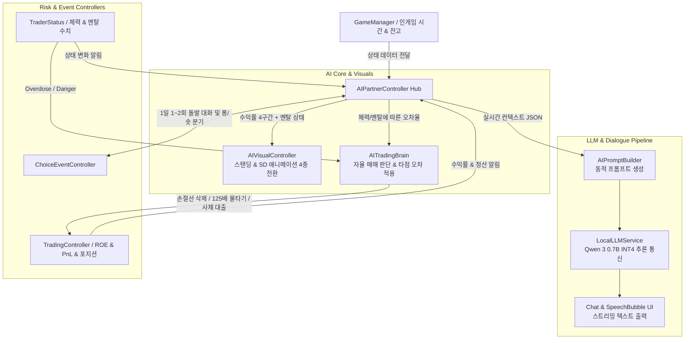

# [FX OVERDOSE] 주인공 AI (자율 멘헤라 트레이더) 개발 로드맵

---

## 1. 개요 및 개발 방향성 (Overview)

`docs/기획서_상세.md`에 정의된 **주인공 AI 트레이더**는 천재적인 트레이딩 감각을 가졌으나 감정 기복과 불안 증세(멘헤라 성향)가 극심한 독고다이 캐릭터입니다. 타인(파트너)에게 의존하거나 대화하는 것이 아닌, **오직 홀로 24시간 비트코인 선물 차트와 싸우며 날것의 혼잣말과 광기 어린 독백을 쏟아내는 자율 매매 트레이더**입니다. 플레이어는 이 고립된 AI의 자율 매매 궤적과 정신적 붕괴 과정을 관찰하며, 필요한 순간 케어 아이템이나 방향성 개입을 통해 청산을 막고 자산을 불려야 합니다.

본 로드맵은 기존에 구축된 `TraderStatus.cs`, `TradingController.cs`, `GameManager.cs` 및 `MarketSimulationEngine.cs`와 완벽히 동기화되어 **시각적 표정 변화, 온디바이스 LLM 기반 실시간 독백/혼잣말 대화, 자율 매매/뇌동매매/대출 기믹, 돌발 선택 이벤트**를 단계별로 구현하기 위한 마일스톤 가이드입니다.

---

## 2. 시스템 아키텍처 및 구성 요소 (System Components)



---

## 3. 단계별 마일스톤 및 구현 과제 (Phase-by-Phase Roadmap)

### 🚩 Phase 1: AI 상태 및 동적 비주얼 제어 (State & Visual Core)
**목표**: 실시간 수익률(`ROE`)과 감정 상태(`MentalState`)에 따라 캐릭터의 표정, 일러스트, SD 픽셀 애니메이션을 동적으로 전환하는 비주얼 기반 마련.

- [ ] **1-1. `AIVisualController` 스탠딩 및 SD 캐릭터 4단계 상태 전환 구현**
  - **수익률 구간별 4종 애니메이션/스탠딩 분기**:
    1. `ROE -100% ~ -50%`: 멍한 눈물 표정, 멘탈 붕괴 상태, 어두운 오라 이펙트
    2. `ROE -50% ~ 0%`: 불안해하며 손톱을 물어뜯거나 초조하게 차트를 보는 상태
    3. `ROE 0% ~ +50%`: 평온하고 집중하며 미소 짓는 기본 상태
    4. `ROE +50% ~ +100% 이상`: 극도의 흥분, 하트 눈, 자신감/광기 넘치는 거만 상태
  - **감정 오버레이 (Emotion Overlay)**: `TraderStatus.CurrentMentalState`가 `Danger` 또는 `Overdose`일 경우 수익률과 별개로 눈물/분노/절망 레이어 및 붉은 경고 오라 적용.

- [ ] **1-2. `TraderStatus` 및 상태 변화 이벤트 고도화**
  - 멘탈 및 체력 변화 시 외부에서 구독 가능한 이벤트(`OnMentalStateChanged`, `OnHealthDepleted`) 추가.
  - 체력 저하 시 매매 피로도 누적에 따른 "차트 분석 타점 오차율(Error Margin)" 프로퍼티 추가.

---

### 🚩 Phase 2: 온디바이스 LLM(`Qwen 3 0.7B INT4`) 연동 및 대화 엔진 (LLM Engine)
**목표**: 정형화된 대본 대신 인게임 실시간 상황 변수를 반영하여 생동감 넘치는 멘헤라 캐릭터의 반응과 대사를 온디바이스 LLM으로 실시간 생성.

- [ ] **2-1. 온디바이스 LLM 모델 준비 및 추론 인터페이스 (`LocalLLMService`) 구축**
  - **모델 파일 준비 및 다운로드**:
    - **모델 규격**: `Qwen 2.5 0.5B Instruct` (또는 0.7B/1.5B급) **GGUF INT4 양자화 모델 (`q4_k_m.gguf`, 약 380MB ~ 500MB)**. 한국어 및 감정 연기(Roleplay) 성능이 가장 뛰어난 초경량 온디바이스 모델.
    - **투트랙(Two-Track) 실행 환경 구성**:
      1. **[개발/빠른 프로토타이핑 단계 - 옵션 A] Ollama 로컬 서버 연동**:
         - PC에 `Ollama` 설치 후 `ollama run qwen2.5:0.5b` (또는 커스텀 GGUF 로드) 실행.
         - Unity C#(`LocalLLMService`)이 `http://localhost:11434/api/generate`로 POST 비동기 요청을 보내어 스트리밍 대사를 즉시 수신 (C++ 플러그인 충돌 없이 프롬프트 튜닝 최적화).
      2. **[최종 빌드/모바일 배포 단계 - 옵션 B] Unity StreamingAssets 내장 (`LlamaSharp` / `LLM for Unity`)**:
         - `Assets/StreamingAssets/Models/qwen2.5-0.5b-instruct-q4_k_m.gguf` 경로에 모델 파일 탑재.
         - 인게임 로딩 시 Native Wrapper를 통해 온디바이스 메모리(CPU/GPU)에서 직접 독립 추론 실행.
  - **스트리밍 수신 및 UI 연동**: 토큰 스트리밍(Token Streaming) 수신 및 말풍선 UI 타이핑 효과(`TypewriterEffect`) 실시간 바인딩.

- [ ] **2-2. 동적 인게임 컨텍스트 프롬프트 빌더 (`AIPromptBuilder`) 구현**
  - 실시간 게임 데이터를 바탕으로 시스템 프롬프트를 조립하는 빌더 클래스 구현:
    ```json
    {
      "system": "너는 극도의 감정 기복을 가진 천재 비트코인 멘헤라 트레이더다. 반말과 집착, 감정적인 어조를 사용한다.",
      "context": {
        "balance": 12450.0,
        "roe_percentage": -42.5,
        "current_position": "Long (10x)",
        "mental_ratio": 0.18,
        "recent_event": "스탑로스 근처까지 가격 하락"
      },
      "instruction": "현재 상황에 맞춰 초조함과 불안함을 드러내며 자신을 탓하거나 위로를 구하는 1~2문장의 짧은 대사를 생성하라."
    }
    ```

- [ ] **2-3. 안전망(Safety Guard) 및 폴백(Fallback) 스크립트 풀 구축**
  - LLM 응답 지연(Timeout > 2초) 또는 기기 오프라인 상태 시 즉시 출력되는 상태별 정형 멘헤라 대사 풀(`FallbackDialogueSO`) 탑재.
  - 부적절한 출력 검열 및 1~3문장 이내 길이 강제 자르기 후처리 로직.

---

### 🚩 Phase 3: 신호 보장 구간(Lock-In) 및 확정적 수익/손해 차트 제어 (Deterministic Override & AI Brain)
**목표**: 현실 시간 대비 빠르게 흘러가는 인게임 속도(1분 = 5초)에서 AI와 플레이어가 신호를 놓치거나 랜덤 노이즈에 의해 억울하게 손실보지 않도록, **'판단 여유 시간(Grace Period)'**과 **'확정적 수익/손해 구간(Guaranteed Profit/Loss Phase)' 강제 오버라이드 시스템**을 차트 엔진에 도입하고, 이에 따른 AI의 상태별 매매 판단을 연계.

- [ ] **3-1. `MarketSimulationEngine`의 확정적 신호 방송 및 주가 오버라이드(`Signal Lock-In`) 시스템**
  - **왜 필요한가?** 차트가 빠르게 변하고 난수가 심하면, 진짜 수익 신호(`True Signal`)에 진입해도 위너 노이즈 때문에 손절되거나, 가짜 신호와 진짜 신호가 빠르게 교차하여 AI가 캐치할 여유가 없음. 따라서 게임적 허용(Game Design Override)을 통해 **신호 발생 시 일정 시간 주가 궤적을 확정적으로 제어하는 안전 장치 및 여유 구간**이 필수적임.
  - **신호 진행 3단계 타임라인 (Timeline of a Signal)**:
    1. **판단 여유 시간 (Grace Window, 예: 인게임 3~5분 / 실제 15~25초)**:
       - 신호(`MarketSignal`) 발생 직후, 차트의 랜덤 노이즈가 최소화되며 횡보 또는 예비 동작을 보임.
       - AI가 차트를 분석하고 대사를 출력하거나, 플레이어에게 매매 제안(`Suggestion Pop-up`)을 할 수 있는 충분한 골든타임을 보장.
    2. **확정적 수익/손해 구간 (Guaranteed Phase, 예: 인게임 15~30분 / 실제 1.5~2.5분)**:
       - **수익 신호(`True Signal - Bullish/Bearish Breakout`)**: 진입 시점부터 보장 시간 동안 랜덤 하락 노이즈를 억제하고, 목표 수익률(예: 주가 ±3%~6%, 10배 레버리지 기준 +30%~+60% ROE)까지 **무조건적인 일방향 주가 상승/하락 드리프트(Deterministic Drift)를 강제 주입**하여 확정적 수익을 보장.
       - **손해/속임수 신호(`False Signal - Bull/Bear Trap`)**: 진입 시 반대 방향으로 무조건적인 급락/급등 빔(청산 유도 드리프트)을 강제 주입하여 확정적 손해 및 멘탈 충격을 발생시킴.
    3. **쿨다운 및 국면 복귀 (Cooldown & Release, 예: 인게임 30~60분)**:
       - 확정 구간 종료 후 즉시 다음 신호가 겹치지 않도록 신호 발생을 차단하고 일반 평균 회귀(`Regime`) 상태로 자연스럽게 복귀.

- [ ] **3-2. AI 매매 판단 엔진 (`AITradingBrain`)의 상태별 여유 시간 내 반응 분기**
  - 신호 발생 후 **여유 시간(Grace Window)** 동안 AI의 체력/멘탈 수치에 따라 자율 독백 및 매매 결정:
    - 🟢 **정상 상태 (`Stable`, 체력 > 70%)**: 여유 시간 내에 `True Signal`을 정확히 포착하여 **"확실한 돌파 타점이다. 내 분석은 틀리지 않아. 20배 롱 진입."**이라며 자만감 넘치는 독백과 함께 진입, 확정적 수익 구간을 누림.
    - 🟡 **피로 누적 상태 (`Anxious`, 체력 < 30%)**: 오차율 증가로 여유 시간 내에 `False Signal`(불트랩)을 대박 신호로 오인하여 진입을 강행. 만약 플레이어가 케어 아이템을 써서 진입을 막거나 오인 진입에서 회복하면 **"와... 아까 들어갔으면 청산이었잖아... 세력 놈들이 내 시드를 노리고 있었어...!"**라며 극심한 안도 및 공포 혼잣말 발생.
    - 🔴 **통제 불능 상태 (`Danger` / `Overdose`)**: 여유 시간이나 확정 구간의 방향과 완전 반대로 고배율 뇌동매매 및 손절선 삭제 강행.

- [ ] **3-3. `TriggerOverdoseTrade` 고도화 및 빚(Debt/Loan) 시스템 연동**
  - `Overdose` 상태 진입 시 3단계 폭주 기믹 강행:
    1. **스탑로스(손절선) 삭제**: 플레이어가 설정해 둔 안전 장치 강제 해제.
    2. **125배 고레버리지 풀시드 물타기**: 잔고 90% 이상을 고배율로 쏟아부음.
    3. **사채/레버리지 대출(`TriggerDebtSystem`)**: 증거금 부족 시 AI가 자율적으로 고리대금을 끌어와 매매(이후 이자 부담 및 청산 위험 극대화).

---

### 🚩 Phase 4: 아이템 케어 & 일일 돌발 선택 이벤트 (Care & Choice Events)
**목표**: 고립된 AI 트레이더를 관리하는 상호작용 및 1일 1~2회 발생하는 고위험·고수익 방향성 선택 분기 구현.

- [ ] **4-1. 4대 아이템군 투입 상호작용 및 AI 혼잣말 리액션 연동**
  - **체력 관리 (에너지 드링크/영양제)**: 피로도 소모 속도 감소 및 실수율 복구 + 카페인 도취 독백.
  - **멘탈 관리 (진정제/디저트/심리상담)**: 감정 수치 즉각 회복 및 뇌동매매 차단 + 심리적 안정감 혼잣말.
  - **트레이딩 장비 / 리스크 헷지 (스탑로스 가이드/손실 보험)**: 수수료 할인 및 청산 보전 버프 활성화 시 거만한 자만 독백.

- [ ] **4-2. 일일 돌발 선택 이벤트 (`ChoiceEventController`) 구축**
  - `GameManager.OnGameMinuteAdvanced` 시간 이벤트와 연계하여 하루 1~2회 돌발 대화 창 발생.
  - **이벤트 예시 및 분기 처리**:
    > *"미국 SEC 규제 발표 루머가 돌고 있습니다! AI 트레이더가 극도의 혼란 속에서 포지션 청산 여부를 고민하며 혼잣말을 중얼거립니다."*
    - 🟢 **[안전 지향 - 강제 청산 및 관망]**: 모든 포지션 즉시 정산 후 3시간 진입 제한 → 체력/기분 회복.
    - 🔴 **[공격 베팅 - 50배 롱 강행 방치!]**: 루머 역이용 50배 진입 → 성공 시 자산 폭등(+150%), 실패 시 청산(-80%) 및 멘탈 0 도달.

---

## 4. 디렉토리 및 클래스 구조 명세 (Class Architecture)

향후 개발 과정에서 폴더 및 스크립트가 체계적으로 관리될 수 있도록 아래 디렉토리 구조를 따릅니다.

```
d:\Project\fx overdose\Assets\Scripts\AI\
├── AIPartnerController.cs       # AI 파트너 중앙 허브 (GameManager, TradingController, TraderStatus 연동)
├── AIVisualController.cs        # 수익률/멘탈에 따른 스탠딩 & SD 픽셀 애니메이션 제어
├── AITradingBrain.cs            # 차트 신호(MarketSignal) 분석, 자율 매매 제안, 오차율 및 뇌동매매 판단
└── ChoiceEventController.cs     # 하루 1~2회 돌발 선택 이벤트 발생 및 분기 처리

d:\Project\fx overdose\Assets\Scripts\AI\LLM\
├── LocalLLMService.cs           # Qwen 3 0.7B INT4 온디바이스 추론 서비스 인터페이스
├── AIPromptBuilder.cs           # 인게임 실시간 상태 데이터 JSON 프롬프트 변환기
└── FallbackDialogueSO.cs        # 오프라인/지연 대비 상황별 정형 스크립트 데이터베이스(ScriptableObject)

d:\Project\fx overdose\Assets\Scripts\Trading\
└── MarketSignal.cs              # 모의 차트 수익 신호(True) 및 속임수 신호(False/Trap) 데이터 구조체 & 이벤트
```

---

## 5. 진행도 및 검증 체크리스트 (Verification Checklist)

| 단계 | 검증 항목 | 테스트 방법 | 상태 |
| :---: | :--- | :--- | :---: |
| **Phase 1** | 수익률 변화에 따른 4단계 표정/스탠딩 정확히 전환되는가? | 모의 차트 가격 강제 변동 후 UI 스탠딩 애니메이터 파라미터 확인 | [/] |
| **Phase 1** | `TraderStatus.CurrentMentalState` 변화 시 경고 오라 적용 여부 | Inspector에서 `currentMental` 값을 20 이하로 줄여 Danger 진입 확인 | [/] |
| **Phase 2** | `AIPromptBuilder`가 현재 잔고/ROE/기분 데이터를 정확히 담는가? | Debug.Log를 통해 생성된 JSON 프롬프트 및 컨텍스트 값 검증 | [/] |
| **Phase 2** | LLM 스트리밍 텍스트가 Typewriter UI를 통해 자연스럽게 출력되는가? | 로컬 추론 서비스 Mocking 또는 실제 엔진 연동 후 대화 발생 테스트 | [/] |
| **Phase 3** | 신호 발생 후 **판단 여유 시간(Grace Window)** 동안 AI 제안/팝업 골든타임이 보장되는가? | `OnMarketSignalGenerated` 발생 후 3~5분간 노이즈 억제 및 AI 제안 UI 대기 검증 | [/] |
| **Phase 3** | **확정적 및 약한 주가 오버라이드(`Strong/Weak Phase`)** 진입 시 목표 ROE까지 주가 궤적이 유지되는가? | `Strong/Weak Signal` 진입 시 목표 ROE(±30% vs ±8%) 드리프트 유지 검증 | [/] |
| **Phase 3** | AI 체력 중간 저하(`Mildly Deceived`) 시 약한 휩소에 적당히 속아 단타 손절(-8%) 리액션을 보이는가? | `currentHealth`를 50%로 설정 후 `Weak False Signal` 발생 시 가벼운 오인 진입 및 리액션 확인 | [/] |
| **Phase 3** | AI 심각한 저하(`Heavily Deceived`) 시 대형 속임수 신호를 진짜로 오인하여 풀시드 물리는가? | `currentHealth`를 20%로 낮춘 뒤 `Strong False Signal` 방송 시 풀시드 오인 진입 검증 | [/] |
| **Phase 3** | Overdose 상태 도달 시 125배 물타기 및 사채 대출이 정상 실행되는가? | 체력/멘탈 0 도달 시 `TradingController` 및 `GameManager` 자산 변동 확인 | [/] |
| **Phase 4** | 1일차 경과 중 1~2회의 돌발 선택 이벤트 팝업이 발생하는가? | 인게임 시간을 고속 재생(`Time.timeScale`)하여 하루 분기 이벤트 검증 | ⬜ |
