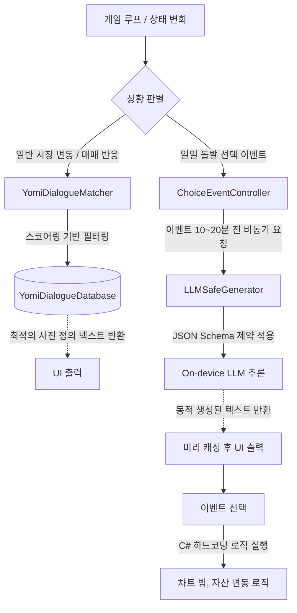

# 통합 대사 시스템 아키텍처 명세서 (Dialogue System Architecture)

본 문서는 『FX Overdose』 프로젝트 내 대사 및 텍스트 생성 시스템의 아키텍처 구조와 설계 원칙을 설명합니다. 
> [!NOTE]
> 이 문서의 양식은 향후 다른 시스템 문서를 작성할 때 템플릿으로 활용할 수 있도록 정규화되었습니다.

---

## 1. 시스템 개요 (System Overview)
게임 내 요미(Yomi)의 대사와 이벤트 시나리오를 관리하는 시스템입니다.
퍼포먼스(프레임 저하) 및 환각(Hallucination) 리스크를 최소화하기 위해 **텍스트 생성 영역과 게임 로직을 완벽히 분리**한 하이브리드(Hybrid) 설계를 채택했습니다. 
현재 런타임에서 작동하는 핵심 기능은 다음 두 가지로 요약됩니다:
1. **하이브리드 돌발 선택 이벤트 (Dynamic LLM Events)**
2. **룰베이스 정적 대사 매칭 (Rule-based Static Dialogue)**

---

## 2. 아키텍처 구조 (Architecture Design)

---

## 3. 핵심 구성 요소 및 클래스 (Core Components)

### 3.1. 하이브리드 돌발 선택 이벤트 (Dynamic Events)
이벤트 시나리오와 뉴스 기사, 선택지 텍스트를 LLM을 통해 동적으로 생성하는 시스템입니다.
*   **`ChoiceEventController.cs`**
    *   **역할:** 이벤트 발생 타이머 제어, 비동기 호출 트리거(`StartPreFetchingLLMEvent`), 유저 선택에 따른 기계적 결과 처리.
    *   **로직 분리:** 롱/숏 포지션 강제 진입, 차트 빔 발생 등의 기계적 결과는 `EventLogicTemplateSO`에 룰베이스로 지정되어 있으며, LLM은 텍스트 번역/생성 역할만 수행합니다.
*   **`LLMSafeGenerator.cs`**
    *   **역할:** 로컬 LLM 서버(llama.cpp 등)와 통신하여 텍스트를 받아오는 비동기 인터페이스입니다.
    *   **안전망:** JSON Grammar 제약을 통해 정해진 포맷 이외의 출력을 원천 차단합니다. 한국어 이외의 응답이 나올 경우 더미(Fallback) 텍스트로 치환합니다.

### 3.2. 룰베이스 정적 대사 매칭 (Rule-based Static Dialogue)
빈번하게 발생하는 일반 매매 리액션이나 시장 변동에 반응하는 대사 시스템입니다. 실시간 LLM 추론으로 인한 렉과 오류를 방지하기 위해 사용됩니다.
*   **`YomiDialogueDatabase` (ScriptableObject)**
    *   **역할:** 대량의 상황별 대사 리스트(`YomiDialogueEntry`)를 보관하는 인메모리 데이터베이스입니다.
*   **`YomiDialogueMatcher.cs`**
    *   **역할:** 실시간 상황 변수(시장 트렌드, 포지션, 멘탈, 레버리지 배율, 위험도 등)를 조합해 `CalculateScore()` 메서드로 점수를 매깁니다.
    *   **중복 방지:** 해시 태그(Hash Tag) 기반의 쿨다운 시스템을 도입해 단기간 내에 동일한 대사가 연속 출력되는 것을 방지합니다.

---

## 4. 구현 및 설계 제약 사항 (Constraints & Rules)

> [!WARNING]
> 본 시스템의 유지보수 시 다음 원칙을 반드시 준수해야 합니다.

1. **로직과 텍스트의 분리 원칙**
   *   절대 LLM이 게임의 밸런스(데미지, 차트 변동량 등) 수치를 직접 결정하게 해서는 안 됩니다.
   *   모든 로직 결과는 C# 코드(State Machine, ScriptableObject)가 통제하며, LLM은 '화면에 그릴 문자열'만 제공해야 합니다.
2. **퍼포먼스 제약**
   *   일반 매매 상황(스탑로스, 포지션 진입 등)에서 LLM API(또는 로컬 추론)를 실시간으로 호출하지 마십시오. 즉각적인 피드백이 필요한 곳은 반드시 `YomiDialogueMatcher` 기반의 정적 매칭을 사용해야 합니다.
   *   LLM 호출이 불가피한 경우(돌발 이벤트) 최소 10분(인게임 시간)의 여유를 두고 코루틴/비동기로 미리 가져와(Pre-fetch) 캐싱해야 합니다.
3. **사용 불가(Deprecated) 스크립트 삭제 유지**
   *   이전 버전에서 사용되던 런타임 실시간 LLM 채팅, 파인튜닝용 데이터셋 추출용 파이썬 스크립트(`train_yomi.py` 등) 및 관련 에디터 스크립트는 영구 삭제되었습니다. 복구하지 않습니다.
