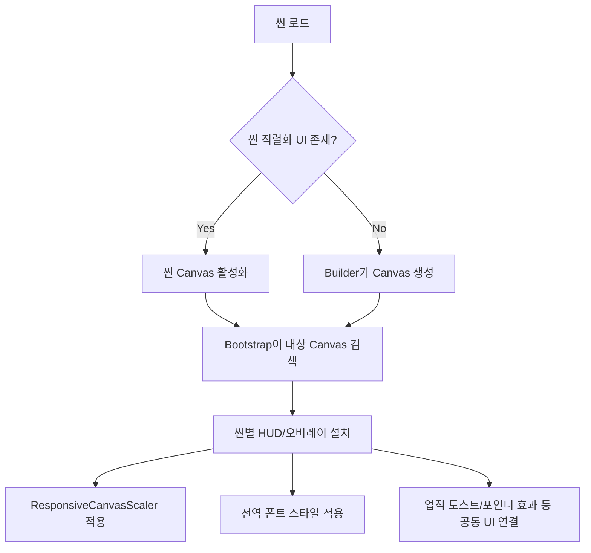

# FX Overdose 전체 씬 UI 구현 및 연결 가이드

## 1. 문서 목적

이 문서는 FX Overdose 프로젝트의 전체 UI를 씬별로 정리한 구현·연결 가이드다. 대상은 다음 씬과 공통 오버레이다.

- `TitleScene`
- `LoadingScene`
- `GameScene`
- `tutorial`
- `YomiRoomScene`
- `WorldMapScene`
- 업적, 설정, 보스, 스킬, 일일 정산, 게임 오버, 컷씬 등 공통 UI

UI는 모두 같은 방식으로 만들어지지 않는다. 프로젝트에는 세 가지 생성 방식이 혼합되어 있다.

| 방식 | 설명 | 예시 |
|---|---|---|
| 씬 직렬화 | `.unity` 파일에 Canvas와 오브젝트가 저장됨 | GameScene 트레이딩 UI |
| 런타임 보강 | 기존 Canvas를 찾아 컴포넌트와 UI를 추가함 | 보스 HUD, 스킬 HUD |
| 런타임 전체 생성 | 씬 로드 시 Canvas부터 코드로 생성함 | 로딩 UI, 요미 방 탑다운 UI |

플레이 중 Hierarchy에서 생성된 UI를 수정해도 씬에는 저장되지 않을 수 있다. 수정 전 반드시 어느 방식인지 확인해야 한다.

## 2. 공통 UI 생성 흐름



주요 런타임 진입점은 `[RuntimeInitializeOnLoadMethod]`와 `SceneManager.sceneLoaded`다. Bootstrap은 씬이 다시 로드되어도 설치될 수 있으므로 대부분 기존 오브젝트 이름이나 컴포넌트를 확인해 중복 생성을 막는다.

## 3. 씬별 UI 요약

| 씬 | 루트 Canvas | 생성 방식 | 핵심 UI |
|---|---|---|---|
| TitleScene | `Canvas_MainMenu` | 씬 + `TitleScreenBuilder` 보강 | 시작, 불러오기, 설정, 업적, 모드 선택 |
| LoadingScene | `Canvas_LoadingScreen` | `LoadingScreenBuilder` 자동 생성 | 로딩 이미지, 진행 바, 상태 문구 |
| GameScene | `TradingViewCanvas` | 씬 직렬화 + 다수 Bootstrap | 차트, 주문, PnL, 상점, 인벤토리, 스킬, 보스 |
| tutorial | `TradingViewCanvas` | GameScene 구조 + TutorialManager | 트레이딩 UI, 하이라이트, 만화 컷씬 |
| YomiRoomScene | `Canvas_YomiRoomTopDown` | `DatingSimSceneBuilder` 자동 생성 | 탑다운 방, 상태 카드, 자유대화, 설정 |
| WorldMapScene | `Canvas_WorldMap` | 씬 + `DatingSimSceneBuilder` 보장 | 알바, 데이트, 방 복귀, 상태 표시 |

## 4. 공통 Canvas 규칙

대부분의 Canvas는 다음 설정을 기준으로 한다.

```text
Render Mode          Screen Space Overlay
UI Scale Mode        Scale With Screen Size
Reference Resolution 1920 × 1080
Screen Match Mode    Match Width Or Height
Match                0.5
```

`ResponsiveCanvasScaler`는 가로형 Root Canvas에 자동 설치된다. 해상도 변화 시 기준 해상도와 Match 값을 적용해 UI 비율을 유지한다.

모바일 폰트 보정은 `MobileFontScaleController.cs`, 공통 PF Stardust 폰트 갱신은 `GlobalPFStardustFont.cs`가 담당한다.

## 5. TitleScene

### 5.1 담당 코드

- `Assets/Scripts/UI/TitleScreenBuilder.cs`
- `Assets/Scripts/UI/MainMenuController.cs`
- `Assets/Scripts/UI/AchievementUIController.cs`
- `Assets/Scripts/UI/ComicCutsceneController.cs`

### 5.2 구성

`TitleScreenBuilder`는 실행 후 `Canvas_MainMenu`를 찾는다. 기존 Canvas가 있으면 게임 모드 패널과 업적 버튼을 보장하고, 없으면 전체 타이틀 UI를 생성한다.

주요 오브젝트:

```text
Canvas_MainMenu
├── 메인 메뉴 버튼
├── Btn_Achievements
├── GameModePanel
├── TutorialPromptPanel
├── OverwritePromptPanel
├── LoadGamePanel
└── SettingsPanel
```

`MainMenuController`가 새 게임, 로드, 설정, 종료, 업적 버튼과 패널을 연결한다. 설정 패널은 열릴 때 `SetAsLastSibling()`으로 최상단에 배치된다.

타이틀 배경은 `Resources/UI/TitleBackground`에서 로드한다.

## 6. LoadingScene

### 6.1 담당 코드

- `Assets/Scripts/UI/LoadingScreenBuilder.cs`
- `Assets/Scripts/UI/LoadingScreenController.cs`

### 6.2 생성 방식

`LoadingScreenBuilder`는 `LoadingScene` 진입을 감지해 `Canvas_LoadingScreen`이 없을 때 전체 UI를 생성한다.

```text
Canvas_LoadingScreen
├── 배경
├── SleepingChibi
├── Progress Slider
├── Percent Text
└── Status Text
```

- Canvas Sorting Order: `10000`
- 이미지 리소스: `Resources/UI/Loading/SleepingChibi`
- `LoadingScreenController.Configure()`에 Slider, 진행률, 상태 텍스트, CanvasGroup을 전달한다.

LLM 준비가 필요한 씬 전환에서는 `LoadingScreenController.RequireLLM`과 `TargetSceneToLoad`를 설정한 뒤 LoadingScene으로 이동해야 한다.

## 7. GameScene 트레이딩 UI

### 7.1 기본 Hierarchy

GameScene의 핵심 UI는 `TradingViewCanvas` 아래에 직렬화되어 있다.

```text
TradingViewCanvas
├── TopStatusBarPanel
│   └── VitalsPanel
├── ChartMainPanel
│   └── TimeframeButtons
├── BottomTradingPanel
│   ├── LongButtonCard
│   ├── ShortButtonCard
│   ├── ClosePositionButton
│   └── PositionStatusPanel
├── ItemButtons
├── ShopOpenButton
├── ShopPanel
├── SettingsButton
└── DialogueBalloonPanel
```

### 7.2 주요 컨트롤러

| UI | 코드 |
|---|---|
| 차트 | `Assets/Scripts/UI/Chart/ChartUIController.cs` |
| 주문·포지션·PnL | `Assets/Scripts/UI/Chart/TradingPanelUIController.cs` |
| 상단 상태 바 | `Assets/Scripts/UI/TopBar/TopStatusBarUIController.cs` |
| 수치 표시 | `Assets/Scripts/UI/VitalsValueUI.cs` |
| 상점 | `Assets/Scripts/Items/DynamicShopUI.cs`, `ShopManager.cs` |
| 인벤토리 | `Assets/Scripts/Items/DynamicInventoryUI.cs`, `Inventory.cs` |
| 설정 | `Assets/Scripts/UI/SettingsMenuController.cs` |

상점과 인벤토리는 Item Data를 읽어 런타임으로 슬롯을 생성한다. 아이템 수량이 0이면 인벤토리 슬롯에서 제외하고, 최소 4칸을 유지한 뒤 아이템 증가에 따라 확장한다.

### 7.3 런타임 자동 설치 UI

GameScene 메인 Canvas에는 다음 Bootstrap이 UI를 추가한다.

| 기능 | Bootstrap/Controller | 비고 |
|---|---|---|
| 캐릭터 레벨 | `TraderLevelUIBootstrap` | GameScene/tutorial |
| 스킬 HUD | `ActiveSkillHUDBootstrap` | GameScene/tutorial |
| 보스 HUD | `BossBattleUIBootstrap` | GameScene 전용 |
| 일일 정산 | `DailySettlementUIBootstrap` | GameScene 전용 |
| 게임 오버 | `GameOverUIBootstrap` | GameScene 전용 |

Bootstrap은 `TradingViewCanvas`를 우선 검색하고 없으면 Root Canvas를 fallback으로 사용한다.

## 8. tutorial 씬

튜토리얼 씬은 GameScene과 거의 동일한 트레이딩 UI 구조를 사용한다. `TutorialManager`가 입력 차단, 대상 하이라이트, 안내 대사와 만화 컷씬 호출을 추가한다.

### 8.1 하이라이트

- 차단 Canvas: `TutorialBlockerCanvas`
- 차단 Canvas Sorting Order: `999`
- 강조 대상 임시 Canvas Sorting Order: `1000`
- 대상 버튼은 원래 부모와 레이아웃 정보를 보존한 상태로 강조한다.

롱, 숏, 포지션 매도 버튼 등은 `TutorialManager`가 단계별 대상으로 지정한다.

### 8.2 만화 컷씬

튜토리얼 씬에는 스토리용 Canvas가 없을 수 있으므로 `ComicCutsceneController.CreateRuntime()`가 `ComicCutsceneCanvas_Runtime`을 생성한다.

- Sorting Order: `1200`
- 구성: ComicImage, NextPanelButton, SkipButton, Caption Panel
- 튜토리얼 대사를 끝까지 출력하고 다음 입력을 받은 뒤 컷씬을 호출한다.

담당 코드:

- `Assets/Scripts/System/TutorialManager.cs`
- `Assets/Scripts/UI/ComicCutsceneController.cs`
- `Assets/Scripts/AI/AIVisualController.cs`

## 9. YomiRoomScene

### 9.1 생성 흐름

`DatingSimSceneBuilder`가 YomiRoomScene 진입을 감지하고 `YomiRoomManager`, `DatingSimLLMController`를 보장한 뒤 `YomiRoomTopDownPrototype.Build()`를 호출한다.

담당 코드:

- `Assets/Scripts/DatingSim/UI/DatingSimSceneBuilder.cs`
- `Assets/Scripts/DatingSim/UI/YomiRoomTopDownPrototypeBuilder.cs`
- `Assets/Scripts/DatingSim/YomiRoom/YomiRoomTopDownPrototype.cs`

### 9.2 화면 구성

좌측 절반은 탑다운 방 카메라, 우측은 채팅 패널이다. 좌측 맵 옆에는 체력, 남은 시간, 호감도, 집착도 카드가 세로로 표시된다.

```text
Canvas_YomiRoomTopDown
├── StaminaCard
├── TimeSlotCard
├── AffectionCard
├── ObsessionCard
├── DialoguePanel
│   ├── SettingsButton
│   ├── HistorySurface/Messages
│   ├── InputSurface
│   └── SendButton
└── InteractionModal
```

상태 카드는 `DatingTimeManager` 이벤트에 연결된다. 채팅은 `YomiRoomDialogueUI`가 `DatingSimLLMController.GenerateChatAsync()`를 호출하며 첫 자유대화에서 시간 슬롯을 확인한다.

채팅 프레임 리소스:

- `Assets/Resources/DatingSim/YomiRoom/UI/Chat/`

상태 아이콘:

- `Assets/Resources/DatingSim/YomiRoom/UI/StatusIcons/`

설정 톱니바퀴:

- `Assets/Resources/DatingSim/YomiRoom/UI/SettingsGear.png`

상호작용 모달은 채팅 UI에 가리지 않도록 생성 완료 후 `SetAsLastSibling()`을 호출한다.

## 10. WorldMapScene

### 10.1 담당 코드

- `Assets/Scripts/DatingSim/UI/DatingSimSceneBuilder.cs`
- `Assets/Scripts/DatingSim/WorldMap/WorldMapUIController.cs`
- `Assets/Scripts/DatingSim/WorldMap/WorldMapManager.cs`

### 10.2 구성과 연결

```text
Canvas_WorldMap
├── 상태 표시
├── FeedbackPanel
├── JobButton
├── DateButton
└── RoomButton
```

`WorldMapUIController.Configure()`가 상태 텍스트와 버튼을 전달받는다.

- JobButton → `WorldMapManager.TryStartPartTimeJob(0)`
- DateButton → `WorldMapManager.TryStartDateCourse(0)`
- RoomButton → `WorldMapManager.ReturnToRoom()`

체력과 시간 슬롯은 `DatingTimeManager`, 자산은 게임의 자금 관리 시스템과 연동한다.

## 11. 공통 설정 UI

담당 코드: `Assets/Scripts/UI/SettingsMenuController.cs`

설정 버튼 클릭 시 `SettingsOverlay`를 현재 Canvas에 생성한다.

- Sorting Order: `200`
- BGM/SFX 슬라이더
- FPS 전환
- 업적 열기
- 저장
- 계속하기
- 게임 종료

GameScene에서는 설정 버튼 아래에 AUTO/USER 모드 버튼도 생성한다. YomiRoomScene은 `ConfigureRoomButton()`으로 `createFloatingModeToggle`을 끄고 설정 메뉴만 재사용한다.

## 12. 업적 UI

### 12.1 업적 목록

- 코드: `Assets/Scripts/UI/AchievementUIController.cs`
- Canvas Sorting Order: `900`
- 진행도: 업적별 0~100% Fill Bar
- 아이콘: `Assets/Resources/UI/Achievements/{achievement.Id}.png`

업적 버튼 또는 설정 메뉴에서 열 수 있다. Canvas가 없으면 컨트롤러가 직접 Canvas와 CanvasScaler를 추가한다.

### 12.2 달성 토스트

- 코드: `Assets/Scripts/UI/AchievementToastUI.cs`
- Sorting Order: `950`
- 평소 비표시
- 달성 시 우측 하단에서 위로 등장
- 약 3초 유지 후 아래로 퇴장

## 13. 스킬 UI

담당 코드: `Assets/Scripts/UI/ActiveSkillHUDController.cs`

`ActiveSkillHUDBootstrap`은 GameScene과 tutorial의 메인 Canvas에 설치한다.

- 숍 버튼 위에 동일 규격의 메인 스킬 버튼 생성
- 클릭 시 3개 스킬의 상세 정보와 업그레이드 버튼을 한 페이지에 표시
- 상세 Overlay Sorting Order: `280`
- 시간 전환 Overlay Sorting Order: `360`
- 아이콘 경로: `Resources/UI/Skills/`

## 14. 보스 UI

담당 코드: `Assets/Scripts/UI/BossBattleUIController.cs`

`BossBattleUIBootstrap`은 GameScene의 `TradingViewCanvas`에만 설치한다.

- 보스 상태와 HP 표시
- 캐릭터 레벨 HUD와 높이 정렬
- 출현 연출은 별도 CanvasGroup으로 처리
- 보스 생성 이벤트와 일일 초기화 순서를 모두 확인해야 하며 단순 씬 시작 시 비활성화하면 생성 직후 사라질 수 있다.

## 15. 일일 정산 및 게임 오버

### 15.1 일일 정산

- 코드: `Assets/Scripts/UI/DailySettlementUIController.cs`
- 기본 Overlay Sorting Order: `1000`
- 일차 완료, 수익 요약, 요미 상태, 다음 날 진행
- CanvasGroup Fade로 등장/퇴장
- 수면 전환 UI는 별도 상위 Sorting Order를 사용

### 15.2 게임 오버

- 코드: `Assets/Scripts/UI/GameOverUIController.cs`
- Sorting Order: `2000`
- 다른 상점·설정 입력을 차단
- 연출 후 타이틀 복귀 버튼 제공

## 16. 공통 Sorting Order

| UI | Sorting Order |
|---|---:|
| 일반 씬 UI | 기본 Canvas 값 |
| 트레이딩 포지션 효과 | 80 / 145 |
| 설정 Overlay | 200 |
| 스킬 상세 | 280 |
| 스킬 시간 전환 | 360 |
| 업적 목록 | 900 |
| 업적 토스트 | 950 |
| 튜토리얼 차단 | 999 |
| 튜토리얼 강조 | 1000 |
| 일일 정산 | 1000 이상 |
| 만화 컷씬 | 1200 |
| 게임 오버 | 2000 |
| 로딩 화면 | 10000 |
| 포인터 효과 | 32000 |

새 Overlay를 만들 때는 이 표를 기준으로 의도한 UI보다 위인지 아래인지 결정한다.

## 17. 공통 에셋 로딩 규칙

`Resources.Load`를 사용하는 UI 에셋은 반드시 `Assets/Resources/` 아래에 있어야 한다.

```csharp
Resources.Load<Sprite>("UI/Skills/SkillMenuIcon");
Resources.Load<Texture2D>("DatingSim/YomiRoom/UI/Chat/ChatFrame");
```

- 확장자는 적지 않는다.
- 픽셀 아트는 Point Filter를 사용한다.
- 반복 경계가 생기지 않도록 Wrap Mode는 Clamp로 둔다.
- 늘어나는 패널은 9-slice Border를 설정하고 `Image.Type.Sliced`를 사용한다.
- 새 PNG에는 반드시 고유한 `.meta` GUID가 있어야 한다.

## 18. UI 수정 위치 빠른 참조

| 변경 목적 | 파일 |
|---|---|
| 타이틀 메뉴 | `TitleScreenBuilder.cs`, `MainMenuController.cs` |
| 로딩 화면 | `LoadingScreenBuilder.cs`, `LoadingScreenController.cs` |
| 상단 상태 바 | `TopStatusBarUIController.cs` |
| 차트 | `ChartUIController.cs` |
| 롱/숏/매도/PnL | `TradingPanelUIController.cs` |
| 상점 | `DynamicShopUI.cs`, `ShopManager.cs` |
| 인벤토리 | `DynamicInventoryUI.cs`, `Inventory.cs` |
| 설정 | `SettingsMenuController.cs` |
| 스킬 | `ActiveSkillHUDController.cs` |
| 보스 | `BossBattleUIController.cs` |
| 업적 | `AchievementUIController.cs`, `AchievementToastUI.cs` |
| 튜토리얼 강조 | `TutorialManager.cs` |
| 만화 컷씬 | `ComicCutsceneController.cs` |
| 일일 정산 | `DailySettlementUIController.cs` |
| 게임 오버 | `GameOverUIController.cs` |
| 요미 방 | `YomiRoomTopDownPrototypeBuilder.cs`, `YomiRoomTopDownPrototype.cs` |
| 월드맵 | `DatingSimSceneBuilder.cs`, `WorldMapUIController.cs` |
| 반응형 비율 | `ResponsiveCanvasScaler.cs` |
| 모바일 폰트 | `MobileFontScaleController.cs` |

## 19. 검증 체크리스트

### 공통

- 1920×1080과 다른 가로 해상도에서 UI가 잘리지 않는가
- Root Canvas에 CanvasScaler가 중복 설치되지 않는가
- 런타임 UI가 씬 재진입 때 중복 생성되지 않는가
- 팝업이 의도한 Sorting Order에 표시되는가
- 닫힌 Overlay가 Raycast를 계속 막지 않는가
- 한글 장문이 패널 밖으로 나오지 않는가

### GameScene/tutorial

- 상단 바, 차트, 주문 패널의 좌우 여백이 일치하는가
- 상점과 인벤토리의 동적 아이템 수가 레이아웃을 깨지 않는가
- 스킬, 설정, 업적, 보스 UI가 서로 겹치지 않는가
- 튜토리얼 차단 중 강조 대상만 클릭 가능한가
- 만화 컷씬이 대사 종료 후 정상 호출되는가

### YomiRoom/WorldMap

- 상태 변화가 `DatingTimeManager` 이벤트로 즉시 반영되는가
- 채팅 장문이 말풍선 내부에 표시되는가
- 상호작용 모달이 채팅 UI에 가려지지 않는가
- 월드맵 버튼이 올바른 Manager 메서드를 호출하는가

## 20. 주의 사항

1. 런타임 생성 UI는 플레이 중 Hierarchy 수정으로 영구 변경되지 않는다.
2. Bootstrap 조건에 씬 이름이 하드코딩된 경우 새 씬에서는 자동 설치되지 않는다.
3. 기존 Canvas와 런타임 Canvas가 같은 기능을 만들면 UI가 두 겹으로 생성될 수 있다.
4. Overlay를 추가할 때 Sorting Order뿐 아니라 `blocksRaycasts`와 `interactable`도 함께 관리해야 한다.
5. UI 이미지 경로 변경 시 모든 `Resources.Load` 문자열을 함께 변경해야 한다.
6. GameScene과 tutorial은 구조가 비슷하지만 보스·정산·게임 오버 Bootstrap의 적용 씬 조건이 다르다.
