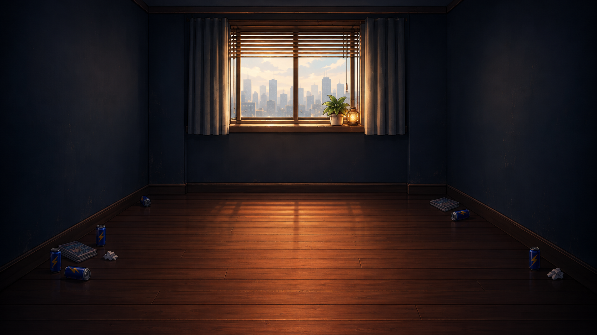

# 요미의 방 포인트 앤 클릭 — 이미지 컨펌 기록

- 작업 시작: 2026-09-15
- 기준: [에셋 발주 명세서](../P2_05_YomiRoom_PointClick_Asset_Order_Spec.md)
- 진행 규칙: **이미지 한 장을 제작한 뒤 사용자 컨펌을 받는다. 컨펌 전에는 수정본이나 다음 이미지를 생성하지 않는다.**
- 첫 시안의 화풍: 명세 §2.1 권장 A안(애니메이션 배경 일러스트). 사용자 확정 전이다.
- 생성 방식: 내장 `image_gen`.
- 현재 상태: **B1 아침 배경 v01 컨펌 대기**.

## 현재 시안

| 항목 | 내용 |
| --- | --- |
| 파일 | [B1_Morning_v01.png](B1_Morning_v01.png) |
| 실제 원본 규격 | 1672×941, PNG, RGB 8bit, 불투명 |
| 용도 | 화풍·분위기·밝기 검토용 시안 |
| 생성 프롬프트 | [B1_Morning_v01.prompt.md](B1_Morning_v01.prompt.md) |
| 참고 이미지 | 기존 `Morning/RoomLeft.png`(색·생활감), `T1/Calm.png`(화풍) |
| 게임 적용 | 미적용. 정식 납품 경로로 옮기기 전 사용자 컨펌 및 규격 검수가 필요하다. |

### 확인한 점

- 정면을 바라보는 방, 어두운 네이비 벽, 따뜻한 원목 바닥과 국소 조명.
- 블라인드·커튼·도시 창밖·화분·앰버 조명과 생활감 소품.
- 중앙 바닥에 캐릭터와 큰 가구가 없고, 별도 오브젝트 레이어를 얹을 공간이 있다.
- 요미 캐릭터 및 클릭 대상 4종은 배경에 그려져 있지 않다.

### 납품 전 보완 및 미검증 사항

- 생성 원본은 명세의 **1920×1080**과 다르다. 현재 파일은 최종 에셋이 아니다.
- 창 높이와 뒷벽 폭 등 공간 골격이 명세 가이드와 다르게 생성되었다. 기준 좌표로 보정이 필요하다.
- 소실점 (960,300) 일치와 모든 깊이 방향 선의 수렴은 정밀 검수 전이다.
- 요미 원본을 발 위치 y940에 올리는 합성 검수는 아직 하지 않았다.
- 최종 sRGB 내보내기·RGBA 규격, 시간대 간 픽셀 정렬, 4K 레이어 원본 PSD 및 게임 내 검수는 후속 단계다.

## 예정 순서

각 항목마다 사용자 컨펌을 받으며 진행한다. 첫 시안의 수정 요청이 있으면 다음 항목보다 먼저 반영한다.

| 순서 | 이미지 | 상태 |
| --- | --- | --- |
| 1 | B1 아침 배경 | v01 컨펌 대기 |
| 2 | O4 문 | 대기 |
| 3 | O3 협탁 + 핸드폰 | 대기 |
| 4 | O2 컴퓨터 | 대기 |
| 5 | O1 침대 | 대기 |
| 6 | B2 점심 배경 | 대기 |
| 7 | B3 저녁 배경 | 대기 |
| 8 | B4 밤 배경 | 대기 |

오브젝트 배치까지 확정된 공통 배경을 기준으로 시간대 변형을 진행한다. 이후 시간대별 요미 합성 확인용 이미지도 한 장씩 확인받고 최종 파일을 정리한다.

