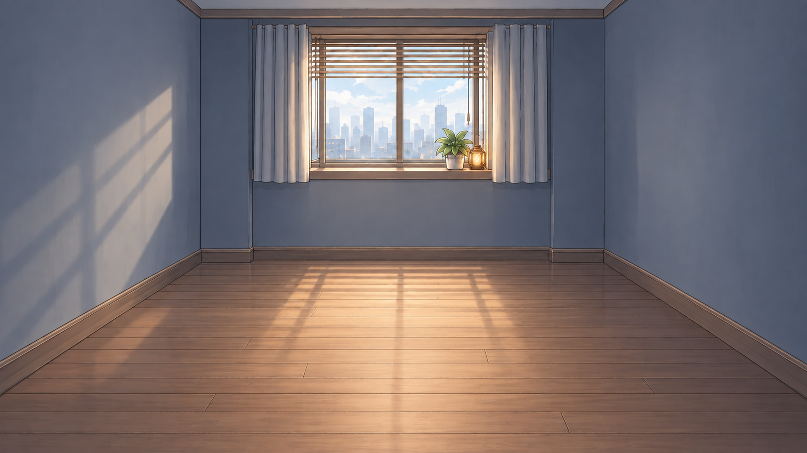

# 요미의 방 포인트 앤 클릭 — 이미지 컨펌 기록

- 작업 시작: 2026-09-15
- 기준: [에셋 발주 명세서](../P2_05_YomiRoom_PointClick_Asset_Order_Spec.md)
- 진행 규칙: **이미지 한 장을 제작한 뒤 사용자 컨펌을 받는다. 수정 요청이 오면 해당 이미지의 수정본 한 장을 만들고 다시 컨펌을 받는다. 다음 에셋은 승인 후 진행한다.**
- 채택한 화풍: 요미 `T1/Calm`의 가는 선화·큰 셀 명암 면·부드러운 회보라색 그림자를 배경에 적용한 B1 v02.
- 생성 방식: 내장 `image_gen`.
- 현재 상태: **B1 아침 v05 질감 정리·1920×1080 내보내기 완료, 사용자 컨펌 대기. 점심 수정은 아침 컨펌 후 진행. O4 문 시안은 보류**.
- 사용자 승인: “이번 이미지 채택하자. 다음 이미지인 레이어 에셋들 작업 진행하자”. 이미지별 컨펌 규칙은 계속 유지한다.

## 반영한 사용자 수정 지시

- 방 안의 캔·잡지·휴지 등 쓰레기 표현을 전부 제거한다.
- 아침으로 읽히도록 실내를 밝히고 강한 검정 비네팅을 완화한다.
- 요미 `T1/Calm`을 기준으로 선화·명암·질감을 분석해 재해석한다.
- **위 지시는 원래 명세의 쓰레기 소품 유지 및 강한 어둠 조건보다 우선한다.** 화풍 분석은 [v02 작업 기록](B1_Morning_v02.prompt.md)에 정리했다.
- 후속 사용자 확인: 핸드폰과 꽃병은 **공용 탁자 하나**에 놓는다.

## 배치 재검토

사용자가 요미·침대·컴퓨터·탁자까지 놓았을 때 문이 간섭하지 않는지 재검토를 요청했다.

- [검토 결과와 제안 좌표](Layout_v01.md)
- [배치 검토 이미지](Layout_v01.png)
- [요미·가구·꽃병·UI 전환 및 평면 구조 검토 화면](Layout_v01.html)
- 문 v01은 요청 영역보다 크게 생성되었고 실제 알파가 없는 RGB 체크무늬 파일이다. [시안](O4_Door_v01.png)과 [프롬프트](O4_Door_v01.prompt.md)를 보관하고 후속 제작은 배치 확인 뒤에 진행한다.

## 채택한 배경

| 항목 | 내용 |
| --- | --- |
| 파일 | [B1_Morning_v02.png](B1_Morning_v02.png) |
| 실제 원본 규격 | 1672×941, PNG, RGB 8bit, 불투명 |
| 용도 | 후속 레이어의 화풍·밝기·배치 기준으로 채택한 배경 |
| 생성 프롬프트 | [B1_Morning_v02.prompt.md](B1_Morning_v02.prompt.md) |
| 참고 이미지 | `B1_Morning_v01.png`(편집 대상), `T1/Calm.png`(화풍) |
| 게임 적용 | 미적용. 이미지 채택 완료, 정식 납품 경로로 옮기기 전 규격 검수가 필요하다. |

### 확인한 점

- 바닥의 캔·잡지·휴지와 벽의 거친 얼룩을 제거했다.
- 정면을 바라보는 방의 큰 구도와 창·커튼·화분·램프 배치를 유지했다.
- 푸른 회색 벽, 따뜻한 원목 바닥, 실내로 퍼지는 아침 자연광으로 밝기를 높였다.
- 선화를 정리하고 큰 명암 면과 부드러운 그림자를 적용해 기존의 거친 질감을 줄였다.
- 중앙 바닥에 캐릭터와 큰 가구가 없고, 별도 오브젝트 레이어를 얹을 공간이 있다.
- 요미 캐릭터 및 클릭 대상 4종은 배경에 그려져 있지 않다.

### 납품 전 보완 및 미검증 사항

- 생성 원본은 명세의 **1920×1080**과 다르다. 이미지 채택과 별개로 최종 내보내기 규격은 보완이 필요하다.
- v02의 창 높이와 뒷벽 폭은 명세 가이드와 다르지만 사용자가 현재 이미지를 채택했다. 후속 레이어는 채택한 방의 실제 벽·바닥 경계를 기준으로 배치한다. 배경 구도를 임의로 다시 그리지 않는다.
- 소실점 (960,300) 일치와 모든 깊이 방향 선의 수렴은 정밀 검수 전이다.
- 요미 원본을 발 위치 y940에 올리는 합성 검수는 아직 하지 않았다.
- 최종 sRGB 내보내기·RGBA 규격, 시간대 간 픽셀 정렬, 4K 레이어 원본 PSD 및 게임 내 검수는 후속 단계다.

## 버전 기록

| 버전 | 내용 | 상태 |
| --- | --- | --- |
| [v01](B1_Morning_v01.png) | 어두운 실내와 바닥 생활감 소품이 있는 첫 시안 | 사용자 수정 요청 반영 대상, 승인되지 않음 |
| [v02](B1_Morning_v02.png) | 쓰레기 제거, 아침 밝기 상향, T1/Calm 기준 화풍 재해석 | 사용자 채택 완료 |

## 예정 순서

각 항목마다 사용자 컨펌을 받으며 진행한다. 첫 시안의 수정 요청이 있으면 다음 항목보다 먼저 반영한다.

| 순서 | 이미지 | 상태 |
| --- | --- | --- |
| 1 | B1 아침 배경 | v02 사용자 채택 완료 |
| 2 | O4 문 | v01 보류, 배치 재검토 확인 대기 |
| 3 | O3 협탁 + 핸드폰 | 대기 |
| 4 | O2 컴퓨터 | 대기 |
| 5 | O1 침대 | 대기 |
| 6 | B2 점심 배경 | 대기 |
| 7 | B3 저녁 배경 | 대기 |
| 8 | B4 밤 배경 | 대기 |

오브젝트 배치까지 확정된 공통 배경을 기준으로 시간대 변형을 진행한다. 이후 시간대별 요미 합성 확인용 이미지도 한 장씩 확인받고 최종 파일을 정리한다.

## 2026-09-16 — 30% 겹침 기준 점검 및 점심 배경

- 최신 사용자 지시: 레이어 겹침은 **각 뒤쪽 오브젝트의 실제 면적 대비 가려지는 비율 30% 이하**를 기준으로 점검한다. 이미지 한 장 제작 후 컨펌하는 규칙을 유지한다.
- 앞서 명세의 사각형만 계산한 값은 문 14.5%, 핸드폰·협탁 26.3%였다. 이는 실제 그림의 알파 면적 검증이 아니다.
- 실제 채택 배경에 대한 [높이 검토 v02](Layout_v02.html)의 투영 함수를 재계산했다.
  - 기존 깊이 약 2.935m, 머리판 1.0m: 문 가림 **44.3%**로 기준 초과.
  - 앞으로 당긴 깊이 2.2m, 머리판 0.7m: 문 가림 **8.6%**, 손잡이 주변 가림 없음.
  - 깊이 2.08m, 머리판 0.5m: 문 가림 **0%**.
- 위 수치는 가구 높이를 반영한 보수적 외곽 모델의 값이다. 채택된 실제 침대나 문 레이어의 수치로 간주하지 않는다. 후속 침대는 0.7m·2.2m 안을 제작 기준으로 삼고 실제 알파 합성에서 다시 확인한다.
- 탁자·꽃병은 하나의 공용 탁자를 사용하는 결정을 유지한다. 요미 중앙 영역과 왼쪽 모니터의 UI 회피 공간도 유지한다.
- 이번에는 아침 v02를 기준으로 **[B2 점심 v01](B2_Noon_v01.png) 한 장만 생성**했다. [프롬프트와 검수 기록](B2_Noon_v01.prompt.md).
- 점심 v01은 **사용자 컨펌 대기**. 출력 규격은 원본과 같은 1672×941로, 게임 적용 전 1920×1080 규격 및 정밀 정렬 검수가 필요하다.
- 위의 기존 예정 순서에 앞서 이번 점심 배경을 먼저 확인한다. 저녁·밤과 나머지 오브젝트는 아직 제작하지 않았다.

## 2026-09-16 — 태양 방향과 창틀 그림자 재검토

- 사용자 지적: 아침·점심 사이 태양 이동이 충분히 반영되지 않았으며 왼쪽 벽의 그림자 형태가 창·블라인드와 맞지 않는다. **두 시간대 모두 조명 수정 대상**이다.
- B1 v02는 구도·화풍 기준으로 유지하되 조명은 재검토한다. B2 v01도 조명 검증을 통과한 것으로 취급하지 않는다.
- 창의 방위·계절 정보가 없어 남동향 창, 북위 37°, 춘추분, 태양시 09:00/12:00을 작업용 가정으로 두고 광선과 바닥·측벽의 첫 교차를 계산했다.
- 계산상 아침은 오른쪽 전경으로 길게, 점심은 창 가까운 왼쪽 바닥으로 짧게 투영된다. 아침에는 측벽 직사광이 없고, 상단 블라인드 그림자는 화면 아래로 벗어난다.
- [계산과 시안 검수 기록](B1_Morning_v03.prompt.md) · [좌표 데이터](Solar_Projection_v01.json) · [아침 투영 도식](Morning_Solar_Guide_v01.png)
- **[B1 v03](B1_Morning_v03.png)은 보류**: 잘못된 벽 무늬는 제거됐지만 직사광 시작점이 계산 y684 대신 y586 부근에 생성됐다.
- 점심은 계산까지 완료했으며 새 이미지 생성은 아직 하지 않았다. 한 장씩 컨펌하는 규칙을 유지한다.
- 계산 마스크를 일반 코드로 합성하는 정밀 후처리 사용 여부를 사용자에게 확인 요청했다.

## 2026-09-16 — 계산 마스크 후처리 승인 및 아침 v04

- 사용자 승인: **“계산 마스크로 정밀 보정”**. 후속 이미지에도 같은 후처리 사용 승인은 유지하되, 에셋 한 장씩 컨펌하는 규칙을 계속 따른다.
- [B1 아침 v04](B1_Morning_v04.png)를 제작했다. 추가 imagegen 호출 없이 v03의 잘못된 바닥 채광을 정리하고 수학적으로 계산한 마스크를 합성했다.
- 목표 직사광 경계 y683.61에 대해 마스크 경계 y683, 오차 약 0.61px. 후처리에서 바닥 밖 픽셀은 변경되지 않았다.
- [보정 방법·검수·제한 사항](B1_Morning_v04.processing.md).
- **아침 v04 사용자 컨펌 대기**. 점심은 계산 완료 상태이며 아침 컨펌 후 같은 방식으로 보정한다.

## 아침 v05 — 잡티 정리와 1080p 내보내기

- 사용자 요청에 따라 아침 v04의 미세 잡티와 과도한 잔결을 정리하고 **[B1 아침 v05](B1_Morning_v05.png)** 한 장을 만들었다.
- 출력은 **1920×1080, 불투명 PNG, sRGB**다. [후처리 방법과 검수](B1_Morning_v05.processing.md).
- 기존 광선 계산 마스크를 새 해상도로 재생성했다. 직사광 경계 오차 약 0.595px.
- **v05 사용자 컨펌 대기**. 점심 수정은 아침 컨펌 후 진행한다.
