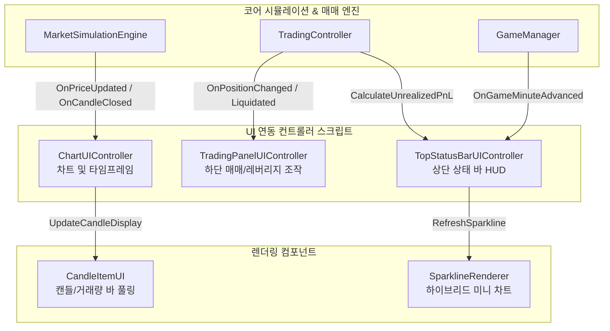

# [FX OVERDOSE] 모의 차트 및 트레이딩 뷰 UI 연동 메서드 명세서

본 문서는 FX OVERDOSE 게임 내 **24시간 비트코인 선물 모의 차트, 트레이딩 뷰 하단 매매 패널, 상단 상태 바(Top Status Bar)**를 유니티 UI 캔버스 오브젝트들과 연동하기 위해 구현된 핵심 스크립트 및 메서드들의 역할을 정리한 공식 명세서입니다. UI 개발자 및 인게임 연동 작업 시 본 문서를 참고하여 버튼 이벤트(`onClick`)와 데이터 바인딩을 구성해 주십시오.

---

## 1. 전체 UI 컨트롤러 아키텍처 및 계층 구조

---

## 2. 영역별 UI 연동 핵심 메서드 명세

### 2.1. 차트 및 캔들스틱 렌더링 영역 (`FXOverdose.UI.Chart`)

#### [ChartUIController.cs](file:///d:/Project/fx%20overdose/Assets/Scripts/UI/Chart/ChartUIController.cs)
차트 영역 전체를 제어하며, 타임프레임 전환 버튼 및 동적 오토 스케일링을 관리합니다.

| 메서드명 | 매개변수 | 호출 시기 및 UI 연동 방법 | 주요 기능 및 연산 설명 |
| :--- | :--- | :--- | :--- |
| **`SelectTimeframe`** | `Timeframe tf` (`M1, M5, M15, H1, H4, D1`) | 타임프레임 UI 버튼(`1m, 5m, ...`)의 `onClick.AddListener`에 바인딩 | 선택된 타임프레임으로 변경하고 탭 버튼 색상을 활성화(`청록색 #06B6D4`) 처리한 뒤, 해당 주기 캔들 히스토리를 불러와 차트를 즉시 리프레시합니다. |
| **`RefreshChartDisplay`** | `없음` | 1초 주가 틱 변경 시(`HandlePriceUpdated`) 및 캔들 확정 시(`HandleCandleClosed`) 내부 자동 호출 | 화면에 노출된 캔들의 `최고가(maxHigh)`와 `최저가(minLow)`를 탐색하여 상하 5% 여백의 **동적 Y축 오토 스케일링**을 수행하고 캔들 오브젝트를 풀링하여 배치합니다. |
| **`UpdateCurrentPriceLine`** | `float currentPrice` | 주가 틱 갱신 시 자동 호출 | 차트 내 실시간 청록색 점선(`Current Price Line`)의 Y 위치를 이동시키고 우측 가격축 태그에 현재가(`67,842.1`)를 표시합니다. |

#### [CandleItemUI.cs](file:///d:/Project/fx%20overdose/Assets/Scripts/UI/Chart/CandleItemUI.cs)
개별 캔들 1개의 몸통(Body), 윗/아랫꼬리(Wick), 하단 거래량 바(Volume Bar)를 그리는 풀링 컴포넌트입니다.

| 메서드명 | 매개변수 | 호출 시기 및 UI 연동 방법 | 주요 기능 및 연산 설명 |
| :--- | :--- | :--- | :--- |
| **`UpdateCandleDisplay`** | `CandleData data` `float chartMinPrice` `float chartMaxPrice` `float chartHeight` `float xPos` `float candleWidth` `float maxVolume` `float volumeAreaHeight` | `ChartUIController.RefreshChartDisplay()` 루프 내에서 개별 캔들마다 호출 | 캔들이 양봉(`#22C55E`)인지 음봉(`#EF4444`)인지 판별하여 색상을 지정하고, 차트 가시 영역 가격 범위에 대비하여 몸통과 꼬리의 높이(`sizeDelta`) 및 Y축 앵커 위치(`anchoredPosition`)를 정확히 렌더링합니다. (도지 방어를 위해 몸통 최소 2px 보장) |

---

### 2.2. 하단 포지션 매매 및 레버리지 조작 영역 (`FXOverdose.UI.Chart`)

#### [TradingPanelUIController.cs](file:///d:/Project/fx%20overdose/Assets/Scripts/UI/Chart/TradingPanelUIController.cs)
참고 이미지 하단의 `LONG` / `SHORT` 진입 버튼, 7단 레버리지 선택 프리셋, 포지션 상태 오버레이 패널을 총괄합니다.

| 메서드명 | 매개변수 | 호출 시기 및 UI 연동 방법 | 주요 기능 및 연산 설명 |
| :--- | :--- | :--- | :--- |
| **`OnLongButtonClicked`** **`OnShortButtonClicked`** | `없음` | UI의 `⬆ LONG` / `⬇ SHORT` 버튼 클릭 이벤트(`onClick`)에 바인딩 | 슬라이더로 설정된 증거금 비율(`selectedMarginPercentage`, 기본 25%)만큼 자산을 투입하여 `TradingController.OpenPosition(PositionType, margin, leverage)`을 실행합니다. |
| **`SelectLeverage`** | `int lev` (`1, 5, 10, 25, 50, 100, 125`) | 7단 프리셋 버튼(`1x, 5x, ...`) 및 `[-]/[+]` 스태퍼 버튼 클릭 시 바인딩 | 선택된 레버리지 배율을 `Mathf.Clamp(1, 125)`로 설정하고, 프리셋 버튼의 하이라이트 색상 및 텍스트(`"10x"`)를 갱신합니다. |
| **`RefreshPanelUI`** | `없음` | 포지션 진입/종료/강제청산 이벤트(`OnPositionChanged`, `OnPositionLiquidated`) 발생 시 자동 호출 | 포지션 보유 여부에 따라 진입 버튼의 활성/비활성 상태를 제어하고, 포지션 보유 중일 때 실시간 `ROE %`, `PnL ($)`, `진입가`, `청산가` 오버레이 패널을 노출합니다. |
| **`UpdatePositionStatusNumbers`** | `없음` | 포지션 보유 중일 때 매 프레임(`Update()`) 자동 호출 | 실시간 주가에 따라 `tradingController.CalculateROEPercentage()`와 `CalculateUnrealizedPnL()`을 호출하여 오버레이 숫자를 60 FPS로 갱신합니다. |

---

### 2.3. 상단 상태 바 및 하이브리드 스파크라인 영역 (`FXOverdose.UI.TopBar`)

#### [TopStatusBarUIController.cs](file:///d:/Project/fx%20overdose/Assets/Scripts/UI/TopBar/TopStatusBarUIController.cs)
참고 이미지 좌측 상단의 3개 카드(`DAY/시간`, `BALANCE`, `P&L`)와 실시간 자산 흐름을 연동합니다.

| 메서드명 | 매개변수 | 호출 시기 및 UI 연동 방법 | 주요 기능 및 연산 설명 |
| :--- | :--- | :--- | :--- |
| **`UpdateDayTimeUI`** | `없음` | `GameManager.OnGameMinuteAdvanced` 이벤트(현실 5초 = 인게임 1분) 발생 시 자동 호출 | `GameManager`의 현재 날짜와 시간(`DAY 03`, `🕒 23:47`)을 텍스트 UI에 반영합니다. |
| **`CalculateTotalEquity`** | `없음` | 매 프레임(`Update()`) 및 히스토리 버퍼 기록 시 호출 (`return float`) | **`[보유 현금 + 포지션 투입 증거금 + 실시간 미실현 손익]`**을 합산한 실시간 총 자산(Total Equity)을 반환합니다. |
| **`UpdateBalanceUI`** | `float currentEquity` | 매 프레임(`Update()`) 자동 호출 | 실시간 총 자산을 달러 포맷(`"$12,458.36"`)으로 상단 `BALANCE` 카드에 반영합니다. |
| **`UpdatePnLUI`** | `float currentEquity` | 매 프레임(`Update()`) 자동 호출 | 초기 자산(`StartingBalance`) 대비 실시간 총 자산의 누적 수익률(`%`)을 계산하여 `"+18.47%"` 또는 `"-12.34%"` 형태로 표시하며, 양수/음수에 따라 녹색(`#22C55E`) 및 적색(`#EF4444`) 색상을 동기화합니다. |

#### [SparklineRenderer.cs](file:///d:/Project/fx%20overdose/Assets/Scripts/UI/TopBar/SparklineRenderer.cs)
`P&L` 카드 우측의 미니 라인 그래프(스파크라인)를 그리는 하이브리드 풀링 렌더러입니다.

| 메서드명 | 매개변수 | 호출 시기 및 UI 연동 방법 | 주요 기능 및 연산 설명 |
| :--- | :--- | :--- | :--- |
| **`RefreshSparkline`** | `List<float> historicalPoints` `float liveTipValue` | `TopStatusBarUIController.Update()` 내에서 매 프레임 호출 | **[하이브리드 렌더링]**: 인게임 15분마다 기록된 **과거 궤적 고정점**들과 매 프레임 변하는 **실시간 끝점(Live Tip)**을 조합하여 UI Line Segment(`Image` 선분 풀링)로 그립니다. 박스 내 최소/최대값 기준 Y축 Auto-Fit을 수행하여 전체 곡선의 흐름과 실시간 파동을 동시에 보여줍니다. |

---

## 3. 코어 시스템 이벤트 구독 명세 (Event Subscriptions)

UI 컨트롤러들은 매 프레임 무거운 연산을 반복하는 대신, 백엔드 엔진이 발행하는 아래의 **이벤트(`Action` / `delegate`)**를 구독하여 화면을 최적화합니다.

| 이벤트명 (발행 주체) | 구독하는 UI 컨트롤러 및 콜백 메서드 | 발생 시기 및 이벤트 역할 |
| :--- | :--- | :--- |
| **`MarketSimulationEngine.OnPriceUpdated`** (`Action<float>`) | `ChartUIController.HandlePriceUpdated(float)` | 1초마다 주가 틱이 변동될 때 발생. 차트 현재가 라인 이동 및 가시 캔들 스케일 갱신. |
| **`MarketSimulationEngine.OnCandleClosed`** (`Action<Timeframe, CandleData>`) | `ChartUIController.HandleCandleClosed(tf, data)` | 1m, 5m, 15m 등 특정 타임프레임 캔들 1개가 완성되었을 때 발생. 차트 히스토리 버퍼 동기화. |
| **`TradingController.OnPositionChanged`** (`Action`) | `TradingPanelUIController.RefreshPanelUI()` `TopStatusBarUIController` (자동 PnL 반영) | 포지션 신규 진입, 물타기(증거금 추가), 종료 발생 시 알림. 하단 버튼 및 오버레이 갱신. |
| **`TradingController.OnPositionLiquidated`** (`Action`) | `TradingPanelUIController.HandlePositionLiquidated()` | 유지 증거금 이하 하락으로 **강제 청산(Liquidation)** 발생 시 알림. UI 초기화 및 경고 텍스트 출력. |
| **`GameManager.OnGameMinuteAdvanced`** (`Action`) | `TopStatusBarUIController.HandleGameMinuteAdvanced()` | 인게임 시간 1분(현실 5초) 경과 시 알림. 날짜/시간 갱신 및 15분마다 스파크라인 버퍼 기록. |

---

## 4. 유니티 씬(Scene) 인스펙터 연결 가이드 (Quick Setup Check)

1. **`Canvas` 하위에 3대 컨트롤러 배치:**
   * `TopStatusBarUIController` (상단 상태 바)
   * `ChartUIController` (중앙 차트 영역)
   * `TradingPanelUIController` (하단 매매 패널)
2. **참조 자동 연결 (`Start() / Awake()` 지원):**
   * 모든 컨트롤러는 인스펙터 비워둘 시 `FindFirstObjectByType<T>()`를 통해 `GameManager`, `MarketSimulationEngine`, `TradingController`를 자동으로 찾도록 방어 코딩되어 있습니다.
   * UI 텍스트(`TMP_Text`) 및 버튼(`Button`), 프리팹(`CandleItemUI`, `Image lineSegmentPrefab`)은 각 스크립트 인스펙터 슬롯에 드래그 앤 드롭으로 지정해 주십시오.
